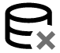
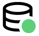
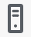

Solution Configuration
######################

.. |add-button| image:: images/appd-add-button.png
    :width: 20

1. Create a DB Collector
========================

.. note::
    
    .. image:: ../images/stop-hand-solid.svg
        :width: 25
        :align: left

    The instructor will demonstrate the activities of this lab for you. Please stop here and watch the demonstration.

Once the database agent has been installed, you can create a collector to monitor the database.

You will need the following information during this exercise:

    - AppDynamics SaaS Controller:

        - Hostname
        - Account Name
        - Username
        - Password

    - Database:
    
        - Database Type
        - Database Agent
        - Collector Name
        - Hostname or IP Address
        - Port
        - Username
        - Password

#. Create a new collector for the database.

    - Navigate to the :guilabel:`Databases` tab in the `ApppDynamics Controller UI <https://cisco-cx-ps-lab.saas.appdynamics.com/controller/>`_.
    - Click :guilabel:`Configuration` on the left navigation panel.
    - Click the **Collectors** option under the :guilabel:`Configuration` section.

    |

    .. image:: images/db-collector-01.png
        :align: center
    
    |

    - Click the **Add** |add-button| button to add a new collector.
    - Fill the requested fields with the following information:

        - **Database Type**: ``MySQL``
        - **Agent**: ``FSO-Training-DB-Agent-Demo``
        - **Collector Name**: ``nopCommerce-demo``
        - **Hostname or IP Address**: MySQL server IP address
        - **Port**: ``3306``
        - **Username**: ``root``
        - **Password**: ``-----``

    - Click **Create**.

    |

    .. image:: images/db-collector-02.png
        :align: center

#. Verify that the collector was created successfully.

    - Navigate to the :guilabel:`Databases` tab on the top navigation panel and confirm that the new collector is listed there.
    - Open the collector and verify that the Health status is ``NORMAL``

        .. image:: images/db-collector-03.png
            :align: center
        
        |

        .. note:: 
            If the health status is ``UNKNOWN``, wait for a few minutes and click the refresh |refresh-button| button.

2. Connect the DB backend to a Collector
========================================

In AppDynamics, uninstrumented databases and remote services are collectively known as backends. 

The nopCommerce MySQL server will appear in your Application Flow Map as an unconnected backend |unconnected-backend-icon|. In this exercise, you will connect the nopCommerce's MySQL database backend to a database collector in the Database Visibility module to track the DB server health status.

You will need the following information during this exercise:

    - AppDynamics SaaS Controller:

        - Host
        - Account Name
        - Username
        - Password

#. Open the `AppDynamics Controller UI <https://cisco-cx-ps-lab.saas.appdynamics.com/controller/>`_, navigate to your nopCommerce application, then to the :guilabel:`Application Dashboard`.

#. Click the unconnected database server icon |unconnected-backend-icon|, then click **Connect** to connect the backend database to the appropriate server in Database Visibility.

    .. image:: images/appd-connect-db-backend.png
        :width: 1000
        :align: center

#. Select your unconnected backend from the list and click **Next**.

    .. image:: images/appd-db-link-dialog1.png
        :width: 700
        :align: center

#. Select the nopCommerce collector, click **Link**, then **Done** to close the wizard.

    .. image:: images/appd-db-link-dialog2.png
        :width: 700
        :align: center

#. Refresh the application flow map view by clicking the refresh |refresh-button| button. The database server icon should now look like this: |connected-backend-icon|.

#. Now that the database backend is connected to a collector in Database Visibility, you can visualize additional DB metrics on the application flow map view by clicking the database icon |connected-backend-icon|. You can also drill down to Database Visibility by clicking **View in Database Visibility** link.

    .. image:: images/appd-db-backend-metrics.png
        :width: 800
        :align: center

3. Configure Business Transactions
==================================

A business transaction represents the end-to-end, cross-tier processing path used to fulfill a request for a service provided by the application.

An important part of implementing AppDynamics is verifying and refining the business transactions used to monitor your application. The business transaction you are monitoring should reflect those operations that are important to your application and business. Refining your business transaction list requires a solid understanding of the important business processes in your environment. It is recommended to identify the 5 to 20 most important operations in the application. These are the key operations that must work well for the application to be successful. 

3.1. Create Business Transaction Rules
--------------------------------------

AppDynamics uses different types of transaction detection rules to define entry points and name business transactions:

- Automatic transaction discovery rules include the default entry point types and naming configuration for each app agent type.
- Custom match rules offer finer control over transaction discovery and naming for a single entry point type.

In this lab, you will use the custom match rules to group all the business transactions in the application that start with ``/ShoppingCart/``.

To do this, follow the steps below:

#. Open the `AppDynamics Controller UI <https://cisco-cx-ps-lab.saas.appdynamics.com/controller/>`_, navigate to the :guilabel:`Applications` tab, and open your nopCommerce application.

#. From the left navigation panel, click :guilabel:`Configuration > Instrumentation > Transaction Detection`

#. Click the **Add** |add-button| button to add a new rule.

#. Create a new custom rule using the following information:

    - **Agent Type**: ``.NET``
    - **Entry Point Type**: ``ASP.NET``

    |

    .. image:: images/bt-rule-01.png
        :width: 800
        :align: center

    |

    - **Name**: ``ShoppingCart``
    - **Scope**: ``Default Scope``

    |

    .. image:: images/bt-rule-02.png
        :width: 800
        :align: center

    |

    Under :guilabel:`Rule Configuration` tab:

    - Click the **Add** |add-button| button to add a new **HTTP Match Request Criteria**: ``URI`` 
    - **Match Rule**: Transaction URL starts with: ``/ShoppingCart/``

    |

    .. image:: images/bt-rule-03.png
        :width: 700
        :align: center

#. Navigate to the :guilabel:`Transaction Detection` tab to verify that the rule was created. The rule should be listed under the ``Rules`` section.

        .. image:: images/bt-rule-04.png
            :width: 1200
            :align: center
        
        |

#. Navigate to the :guilabel:`Business Transactions` page and look for the ``ShoppingCart`` business transaction. It could take a few minutes to appear in the list of BTs. If needed, use the refresh |refresh-button| button to refresh the view.

        |

        .. image:: images/bt-rule-05.png
            :width: 1200
            :align: center

3.2. Enable Business Transaction Lock Down
------------------------------------------

AppDynamics automatically discovers Business Transactions out-of-the-box. While the Auto Discovery rules are impressive, they won’t necessarily work perfectly for every customer. They are a “one-size fits all” best estimation of what might be useful Business Transactions (BTs), but never a good fit for anyone specific customer.

In this exercise, you will enable Business Transaction Lock Down, a best practice that prevents “explosion” scenarios in which the system reaches the > 200 business transactions limit. Using Business Transaction Lockdown combines all newly discovered BTs into one ``All Other Traffic`` transaction. From there, you can manually register a business transaction as first-class. Registering key transactions allows you to identify and monitor only the most important transactions in your environment. You generally perform this process during initial system configuration or to fine-tune an existing system to align with customer experience.

To enable the business transaction lockdown:

#. Open the `AppDynamics Controller UI <https://cisco-cx-ps-lab.saas.appdynamics.com/controller/>`_.
#. Navigate to the :guilabel:`Applications` tab and open your application.
#. From the left navigation panel, click :guilabel:`Configuration > Instrumentation > Transaction Detection > More`
#. Under Business Transaction Lock Down, check the **Enable Business Transaction Lock Down** checkbox and click **Save**.

    |

    .. image:: images/bt-lock-down.png
        :align: center

4. Enable Agentless Transaction Analytics
=========================================

Analytics extracts the data, generates baselines and dashboards, and provides a perspective beyond traditional APM by enabling real-time analysis of business performance correlated with your application performance.

The Analytics Agent is not required to capture Transaction Analytics data for Java or .NET Windows applications. Instead, Analytics can retrieve data directly from your app agent for this type of application. For this reason, this deployment model is called "Agentless Analytics".

In this lab, you will enable "Agentless Analytics" for nopCommerce application to allow ACME to capture transactions data used to create custom business metrics (e.g.: Number of Orders per minute).

#. Open the `AppDynamics Controller UI <https://cisco-cx-ps-lab.saas.appdynamics.com/controller/>`_ and navigate to :guilabel:`Analytics > Configuration`.

#. Enable transaction analytics for your assigned nopCommerce application and ensure it is also enabled for all Business Transactions except for the "All Other Traffic - <Tier>".

#. Click **Save**.

    .. image:: images/enable-trans-analytics.png
        :width: 1200
        :align: center

#. The previous steps are not enough the enable Transaction Analytics for .NET applications when using the Agentless approach. We need to add the ``agentless-analytics-disabled`` property to the nopCommerce node and set it ``false``. To do so, navigate to the :guilabel:`Applications` tab, open your nopCommerce application and click :guilabel:`Tiers & Nodes`. Expand the **Web** tier and double-click on the node |node-icon| to access the node dashboard.

    .. image:: images/analytics-node.png
        :width: 1200
        :align: center

#. Click :guilabel:`Actions`, then click :guilabel:`Configure App Server Agent`.

    .. image:: images/node-configure.png
        :width: 1200
        :align: center

#. Expand the **Web** tier, select the nopcommerce node |node-icon|, then choose **Use Custom Configuration** option and click the Add property button |add-button|. 

    .. image:: images/node-properties1.png
        :width: 1200
        :align: center

#. Enter the following information in the pop-up window to create a new agent property:

    - **Name**: ``agentless-analytics-disabled``
    - **Description**: ``Enable/disable agentless analytics`` 
    - **Type**: ``Boolean``
    - **Value**: ``False``

    | 

    .. image:: images/node-properties2.png
        :width: 600
        :align: center

#. A few minutes later, you should see Transaction Analytics data for your application in the :guilabel:`Analytics` tab.

    .. image:: images/appd-transaction-analytics.png
        :width: 1200
        :align: center

**Congratulations!** You have enabled Transaction Analytics for your nopCommerce application.

.. note::
    Additional information on Agentless Analytics can be found `here <https://docs.appdynamics.com/latest/en/analytics/deploy-analytics-without-the-analytics-agent>`_.

5. Create a Custom Metric
=========================

ACME wants to track the **number of orders per minute** placed through the nopCommerce store, as this is an important metric for the business.

You have worked with ACME's online store developers to identify the Business Transaction (BT) invoked every time an order is placed. This BT is called ``/Checkout/Completed``.

In this exercise, you will leverage AppDynamics' Transaction Analytics to create a custom metric to track the number of orders placed per minute. To do so, you will create a scheduled search using `AppDyanmics Query Language (ADQL) <https://docs.appdynamics.com/latest/en/analytics/adql-reference>`_. ADQL is a query language for searching available data in Analytics. It is similar to the SELECT statement in the prevalent Structure Query Language (SQL) but is designed solely for AppDynamics Analytics data.

#. Navigate to the :guilabel:`Analytics` tab in the `ApppDynamics Controller UI <https://cisco-cx-ps-lab.saas.appdynamics.com/controller/>`_. Next, click :guilabel:`Searches` on the left navigation menu, click the **Add** |add-button| button and choose :guilabel:`Query Language Search`.

    .. image:: images/analytics-create-search1.png
        :width: 1200
        :align: center

#. Enter the following ADQL query (replace ``#`` symbol with your student number) and click **Search**.

    .. code-block:: sql
    
        SELECT count(*) FROM transactions WHERE application = "nopCommerce-#" AND transactionName = "/Checkout/Completed"

    .. hint::
        To simplify entering your queries in Analytics Search, the ADQL auto-complete feature displays keywords, a list of available fields, and functions based on the stage of your typed search.

    The following example counts the number of ``/Checkout/Completed`` transactions for nopCommerce-1 application (student-1):

    .. image:: images/analytics-create-search2.png
        :width: 1200
        :align: center

#. Confirm there are records found for the search, then click :guilabel:`Actions > Create Metric`.

    .. image:: images/analytics-create-metric1.png
        :width: 1200
        :align: center
    
    |

    .. note::
        A metric can only be created for an aggregate query that returns a single numeric value. For more details, see the docs page: `Create Analytics Metrics From Scheduled Queries <https://docs.appdynamics.com/latest/en/analytics/using-analytics-data/create-analytics-metrics-from-scheduled-queries>`_

#. Give your metric a name and a description in the pop-up window. The name determines how the metric appears in the Metrics panel and the Metric Browser. For the sake of this exercise, please use the following name, where ``#`` is your student number.

    - **Metric Name**: ``nopCommerce# - Orders``

    |

    Assuming you are student-1, the metric name will look like this:

    .. image:: images/analytics-create-metric-dialog.png
        :width: 600
        :align: center

    .. note::
        Please, keep in mind that:

        - Metrics are truncated to whole values. So values less than one are truncated to zero.
        - Math operations are only supported inside the aggregation function. For example, ``count(numeric_field_name * 10)`` from transactions.

#. Click :guilabel:`Metrics` on the left navigation menu and confirm that your new metric is listed there.

    .. image:: images/analytics-metrics-list.png
        :width: 1200
        :align: center

#. Select your metric in the list and click the **Metric Browser** |metric-browser-button| button to see your new "nopCommerce# - Orders" metric in the Metric Browser.

    .. image:: images/metric-browser-orders.png
        :width: 1200
        :align: center

    |

    The search will execute once per minute and report the results as a metric. You can create alerts on the metric in the usual way using Health Rules to trigger Policies and Actions.

6. Create an Alert
==================

ACME wants to alert its AppOps team whenever a business transaction is unhealthy. One condition for ACME to consider that a BT is healthy is when the BT's average response time is under 1000ms during the last 30min.

In this lab, you will address ACME’s alerting requirement by configuring a Health Rule, an Action, and a Policy, which together will allow sending email alerts whenever the ``BT Health - ShoppingCart`` business transaction is unhealthy.

6.1. Create a Health Rule
-------------------------

Health rules let you specify the parameters that represent what you consider normal or expected operations for your environment. The parameters rely on metric values, for example, the average response time for a business transaction or CPU utilization for a node.

Having created or discovered the business transaction, you can now create health rules to monitor the application's health. To do this, follow the steps below:

#. Open your nopCommerce application in the `ApppDynamics Controller UI <https://cisco-cx-ps-lab.saas.appdynamics.com/controller/>`_.
#. Navigate to the :guilabel:`Alert & Respond` tab and click :guilabel:`Health Rules` on the left side menu.

#. Click the |add-button| button to create a new Health Rule using the following information:

    On the :guilabel:`Overview` tab:

    - **Name**: ``BT Health - ShoppingCart``

    |

    .. image:: images/health-rule-01.png
        :width: 1200
        :align: center

    On the :guilabel:`Affected Entities` tab:

    - **Health Rule Type**: ``Business Transaction Performance (load, response time, slow calls, etc)``
    - **Business Transactions this Health Rule affects**: ``These specified Business Transactions``
    - **Business Transaction**: ``ShoppingCart``

    |

    .. image:: images/health-rule-02.png
        :width: 1200
        :align: center

    On the :guilabel:`Critical Criteria` tab:

    - **Metric Name**: ``Response Time``
    - **Metric**: ``Average Response Time (ms)``
    - **Type of comparison**: ``> Specific Value``
    - **Threshold Value**: ``1000``
    - **Trigger only when violation occurs**: ``3 times``

    |

    .. image:: images/health-rule-03.png
        :width: 1200
        :align: center

    |

     .. tip ::
        When multiple conditions are added, pay attention to the drop-down list above the conditions, you may want to select ``All`` or ``Any`` or ``Custom`` depending on your needs.
    

    On the :guilabel:`Warning Criteria` tab:

    - Click **Copy from Critical Criteria** button to copy the Critical Criteria values to the Warning Criteria tab.
    - Change the threshold value next to **> Specific Value** to ``700``.
    - **Save** the Health Rule.

    |

    .. image:: images/health-rule-04.png
        :width: 1200
        :align: center
    
    The rule should now be enabled and listed under the :guilabel:`Health Rules` section.

        .. image:: images/health-rule-05.png
            :width: 1200
            :align: center
        
        |

    .. note ::
        (Optional) You can play setting different threshold values to the Warning and Critical conditions to see how the health rule behaves.

6.2. Create an Action
---------------------

An action is a predefined, reusable, automated response to an event.

To create an action, follow the steps below:

#. Open your nopCommerce application in the `ApppDynamics Controller UI <https://cisco-cx-ps-lab.saas.appdynamics.com/controller/>`_.

#. Navigate to the :guilabel:`Alert & Respond` tab and click :guilabel:`Actions` on the left side menu.

#. Click the **Create** |add-button| button to create a new Action.

#. Enter the following information in the pop-up window:

    - Select **Send an email** option under the Notifications section and click **OK** to continue.

    |

    .. image:: images/action-01.png
        :width: 600
        :align: center
    
    - Type your **email address** ``your-cec-id@cisco.com`` and click **Save**.

    |

    .. image:: images/action-02.png
        :width: 600
        :align: center

6.3. Create a Policy
--------------------

A policy can trigger an action in response to any event. You configure which actions are triggered by which events when you configure policies. For example, you can use policies to automate monitoring, alerting, and problem remediation.

Now that you have a Health Rule for the "ShoppingCart" business transaction and an Action to send an email, let’s create a policy that alerts you by email whenever the ``BT Health - ShoppingCart`` health rule is violated.

#. Open your nopCommerce application in the `ApppDynamics Controller UI <https://cisco-cx-ps-lab.saas.appdynamics.com/controller/>`_.

#. Navigate to the :guilabel:`Alert & Respond` tab and click :guilabel:`Policies` on the left side menu.

#. Click **Create Policy Manually** to create a new policy using the following information:

    On the :guilabel:`Trigger` tab:

    - Set **Name** to ``Send Alert by Email``
    - Expand the **Health Rule Violation Events** section and check the following options:

        - **Health Rule Violation Started - Warning**
        - **Health Rule Violation Started - Critical**

    |

    .. image:: images/policy-01.png
        :width: 1200
        :align: center
    
    - On the :guilabel:`Health Rule Scope` tab:

        - Select **These Health Rules**.
        - Click the |add-button| button to select the desired health rules.
        - Select the ``BT Health - ShoppingCart`` health rule and click **Select Health Rule(s)** to confirm the selection.

    |

    .. image:: images/policy-02.png
        :width: 1200
        :align: center
    
    |

    - On the :guilabel:`Actions` tab:

        - Click the **Create** |add-button| button to add a new action.
        - Select ``your-cec-id@cisco.com`` action created on the previous exercise and click **Select**.

    |

    .. image:: images/policy-03.png
        :width: 1200
        :align: center

    |

    - Click **OK** to configure the action.

    |

    .. image:: images/policy-04.png
        :width: 600
        :align: center

    |

    - Click **Save** to save the policy.

    |

    **Congratulations**, your policy is ready! As soon as the ``BT Health - ShoppingCart`` health rule is violated, the specified action will be triggered, and an alert message will be sent to the specified email address.

.. sectionauthor:: Jairo Leon <jaileon@cisco.com>, Ovesnel Mas Lara <omaslara@cisco.com>