Solution Configuration
######################

You will start by accessing the AppDynamics controller and validating the "SockShop-fso-demo" application. As previously pointed out this application has already been onboarded on an AppDynamics SaaS controller.

1. Walkthrough AppDynamics “SockShop-fso-demo” onboarded application
--------------------------------------------------------------------

1.1. Access the AppDynamics controller graphical user interface (GUI)
^^^^^^^^^^^^^^^^^^^^^^^^^^^^^^^^^^^^^^^^^^^^^^^^^^^^^^^^^^^^^^^^^^^^^

Access the AppDynamics SaaS controller by opening the URL https://cisco-cx-ps-lab.saas.appdynamics.com in your browser. You will be prompted for your AppDynamics credentials. Use your provided credentials to login:

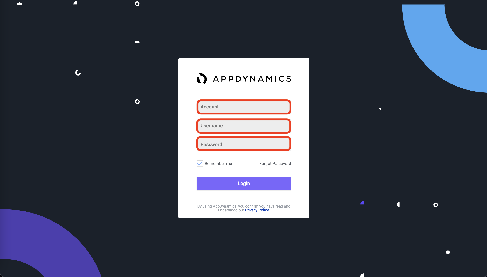

.. tip::
    We recommend using the private/incognito mode of your browser.

1.2. Identify the components of the "SockShop-fso-demo" application
^^^^^^^^^^^^^^^^^^^^^^^^^^^^^^^^^^^^^^^^^^^^^^^^^^^^^^^^^^^^^^^^^^^

Once you login you will land on the :guilabel:`Home > Overview` page of the AppDynamics controller. Identify the :guilabel:`Applications` card which lists all onboarded applications and click on the :guilabel:`SockShop-fso-demo` application:

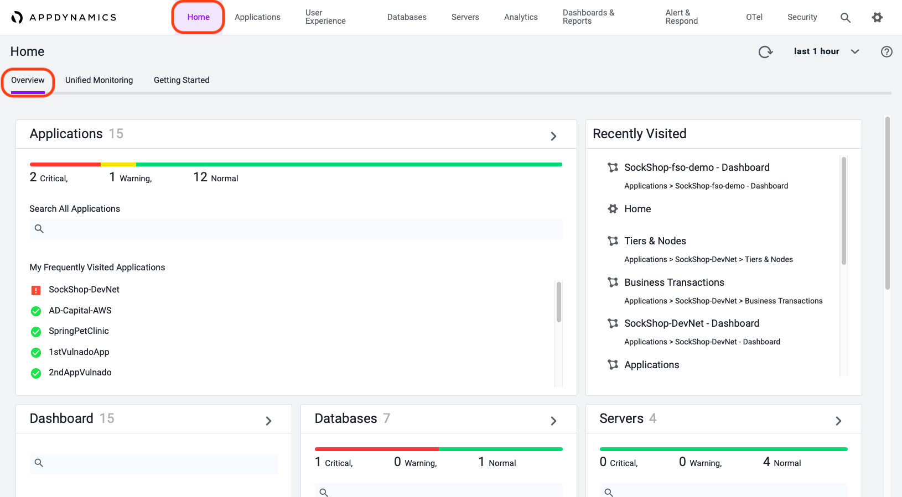

.. tip::
    There are several ways to access some of the options on the AppDynamics user interfaces. 

In order to look at all the applications managed by the AppDynamics controller, navigate to :guilabel:`Applications` tab. Here pay attention to the :guilabel:`SockShop-fso-demo` application.

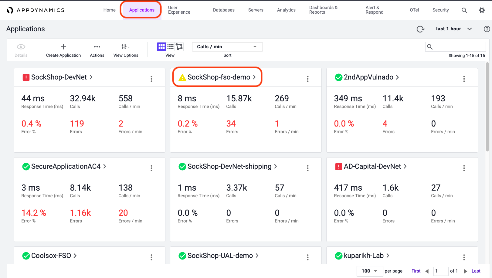

Click on the :guilabel:`SockShop-fso-demo` application to switch to the application view. The :guilabel:`Application Flow Map` tool located on the :guilabel:`Application Dashboard` of the left navigation menu allows you to visualize the flow between the different tiers and connection endpoints (databases & remote services) of your application:

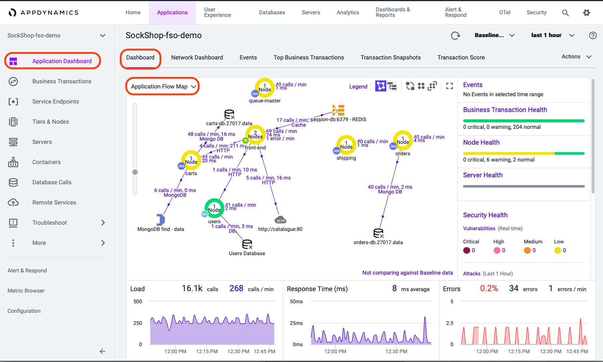

Navigate through each options on the left navigation menu and take note of the following elements for the “SockShop-fso-demo" application:

.. list-table::
   :align: center
   :widths: 25 65
   :header-rows: 1

   * - Business Application Name
     - SockShop-fso-demo
   * - Business Transaction(s)
     -
   * - Tier(s)
     - 
   * - Node(s)
     -
   * - Database(s)
     -
   * - Server(s)
     -

2. Walkthrough AppDynamics and Intersight integration
-----------------------------------------------------

2.1. Access Intersight GUI
^^^^^^^^^^^^^^^^^^^^^^^^^^

After verifying the “SockShop-fso-demo” application on AppDynamics, you will now walkthrough the steps needed to integrate AppDynamics and Intersight.

Start by going to https://intersight.com and logging in using the provided credentials:

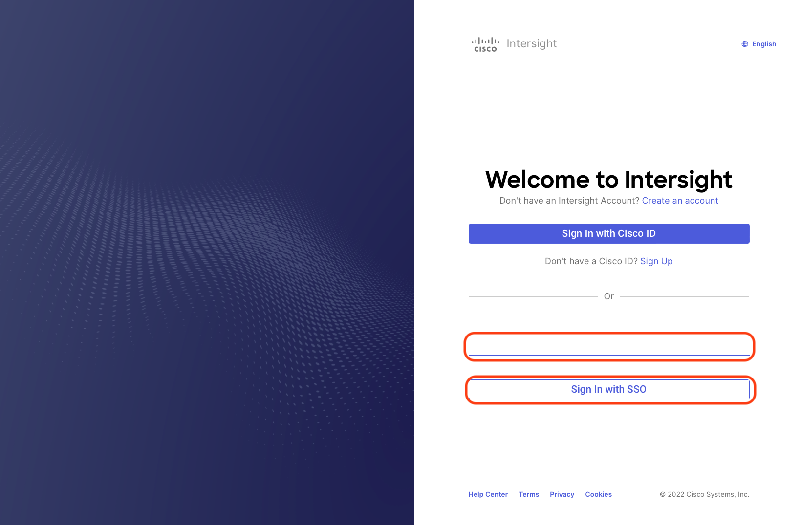

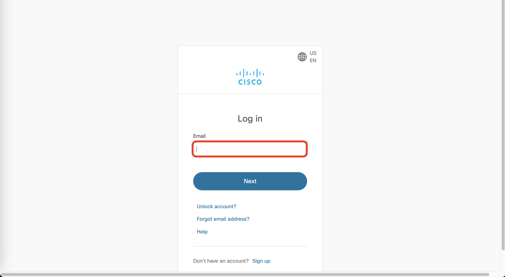

You may be prompted to select an Account and Role if you have previously created an Intersight account. If that is the case, select the :guilabel:`CX-PM` account:

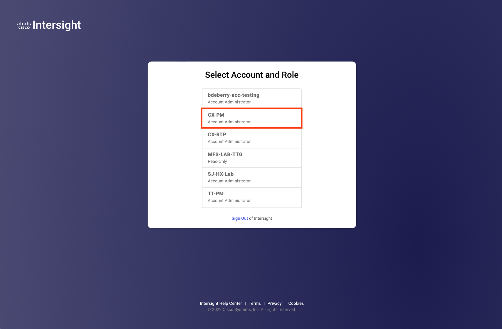

You should be able to login and see the main Intersight interface. 

Intersight Workload Optimizer (IWO) is an Intersight feature that continuously analyzes workload consumption, costs and compliance constraints and automatically allocates resources in real-time. It assures workload performance by giving workloads the resources they need when they need them. It also helps with capacity planning and workload placement across multiple clouds.

2.2. Verify Intersight Workload Optimizer licensing compliance
^^^^^^^^^^^^^^^^^^^^^^^^^^^^^^^^^^^^^^^^^^^^^^^^^^^^^^^^^^^^^^

Intersight Workload Optimizer (IWO) requires licensing and it is provisioned using Cisco Smart Software Manager. For more information on the different Intersight licensing tiers, please refer to the `Intersight Licensing Requirements Documentation <https://intersight.com/help/saas/getting_started/licensing_requirements>`_.

.. note:: 
    To support the Hybrid Cost Optimization (HCO) use case, a minimum licensing tier of “Advantage” is required. When delivering to a customer, you may need to register the Intersight license on their behalf or guide them with that process. For information on how to register Intersight with Cisco Smart Licensing, refer to the `Intersight Licensing Documentation <https://intersight.com/help/saas/getting_started/licensing_requirements#registering_intersight_with_cisco_smart_licensing>`_.

Next, you will check Intersight license status. Navigate to :guilabel:`Services icon > System > Licensing`. The Licensing page is displayed:

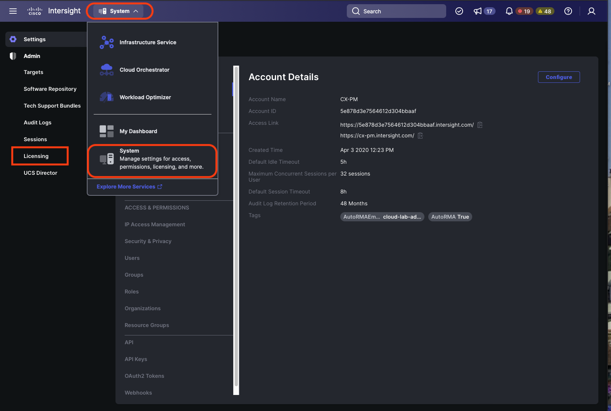

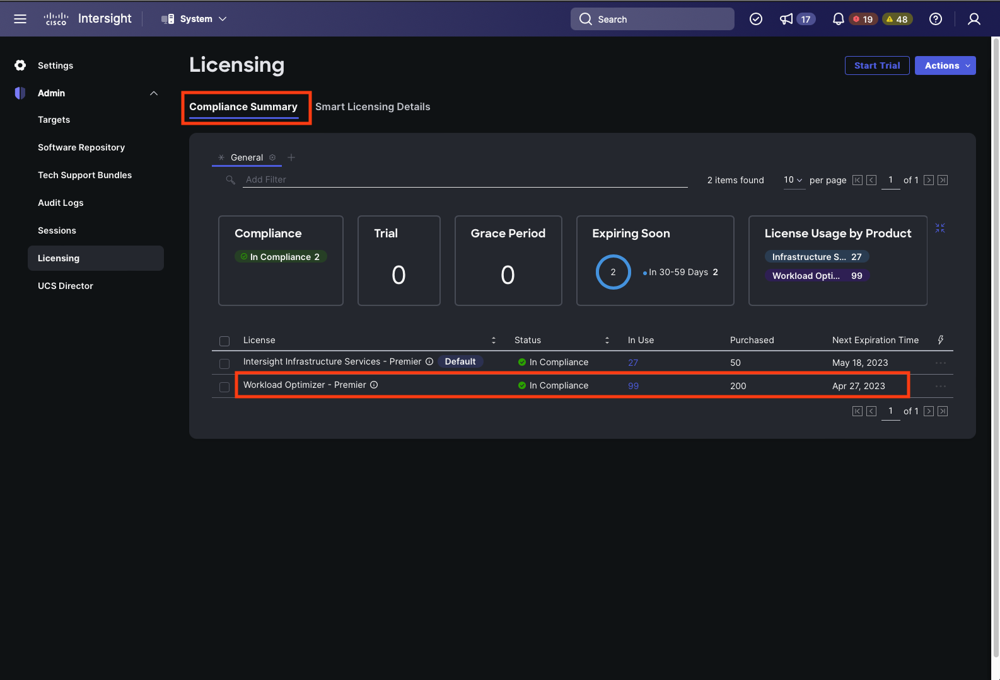

Verify that the Workload Optimizer license show as “In Compliance” for at least the “Advantage” tier.

Intersight account license state could be one of the following depending on your subscription status:

- **Not Used** — This status is displayed when the server count in a license tier is 0.
- **In Compliance** —The account licensing state is in compliance and all the supported features are available to the users.
- **Out of Compliance** —The account license status displays Out of Compliance in the following cases:

  - When not enough valid licenses are available because the subscription has reached the end of term or you have more servers in the license tier than available licenses.
  - When the grace period of 90 days is active or expired
  - The servers are added to the account but not registered in the Smart Licensing account

2.3. Walkthrough the steps to claim AppDynamics target into Intersight
^^^^^^^^^^^^^^^^^^^^^^^^^^^^^^^^^^^^^^^^^^^^^^^^^^^^^^^^^^^^^^^^^^^^^^

After license verification, the next step would be to claim the “AppDynamics” target into Intersight. 

.. note:: 
    In our lab, we have already claimed AppDynamics targets in advance. This was done to allow IWO enough time to capture necessary application data and insights that can generate meaningful recommendations. Your Intersight lab account permissions won't allow you to claim any new target or to follow the steps to do it showed up on the remaining of this section. The steps and screen captures are provided for your reference when delivering to a customer. You can, however, see the claimed targets and their status. If you click on them you can also see detailed related information.

To claim your AppDynamics target by navigating to :guilabel:`ADMIN > Targets > Claim a New Target`:

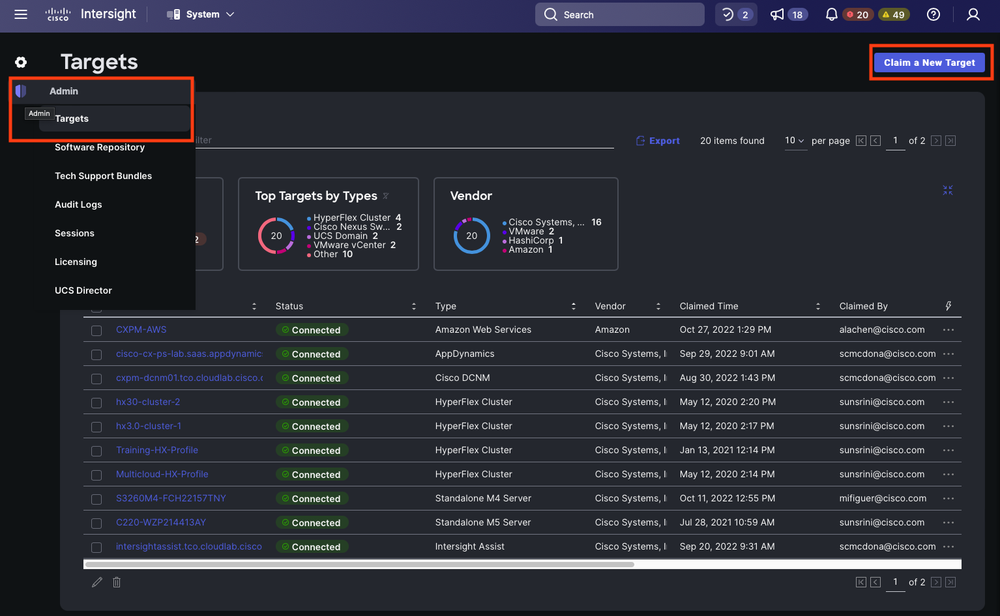

You would select :guilabel:`Cisco AppDynamics` from the "Available for Claiming" list (you could filter the list by the :guilabel:`Application Performance Monitoring (APM)` Category to make it easier to see):

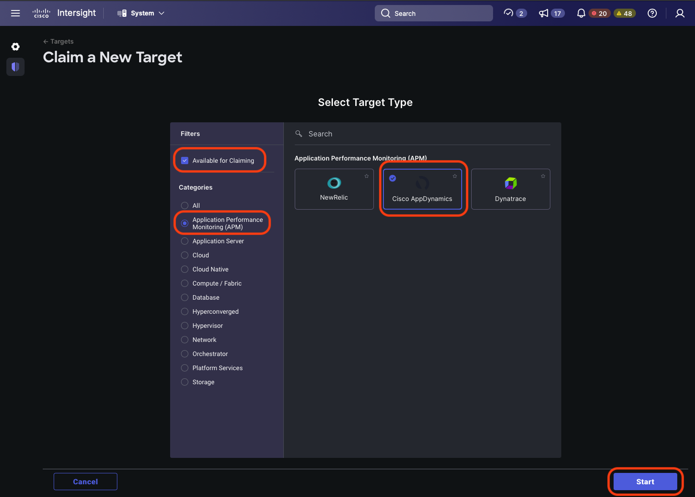

Click :guilabel:`Start` to be prompted with the following options:

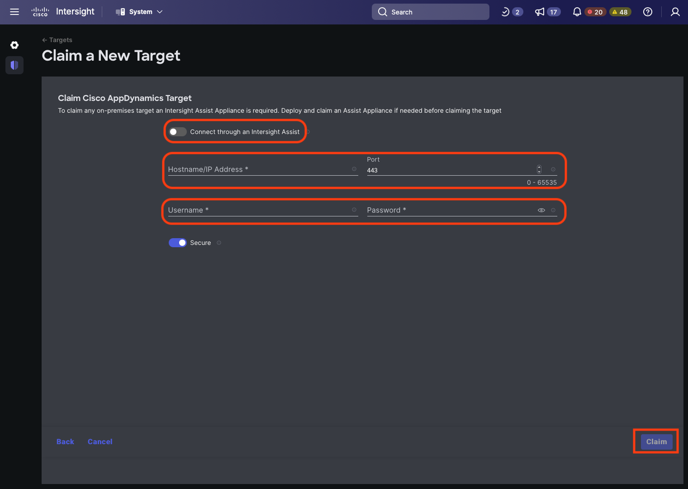

Then, you would enter the required details and click :guilabel:`Claim` to complete the claiming process.

.. note::
    You will get an error if you try to claim a target already claimed.

Verify that the AppDynamics target is claimed by navigating to :guilabel:`ADMIN > Targets`:

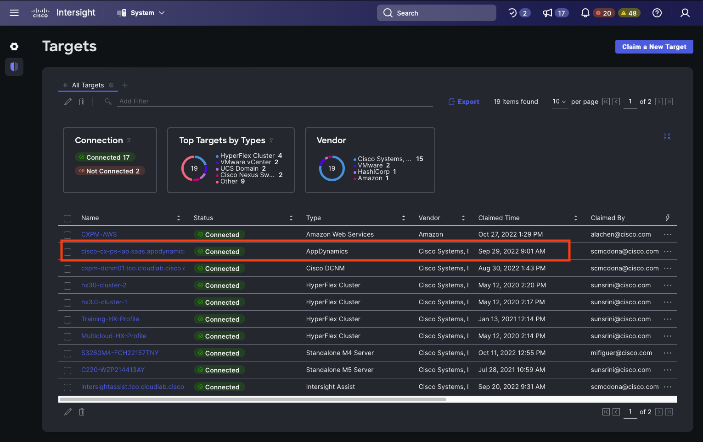

Your AppDynamics targets should be in “Connected” Status.

3. Walkthrough Intersight Workload Optimizer “SockShop-fso-demo” supply chain
-----------------------------------------------------------------------------

Once the AppDynamics target is “claimed”, it will take some time for the data synchronization between AppDynamics and Intersight to occur and the Workload Optimizer to start showing information for the applications onboarded.

Intersight Workload Optimizer models your environment as a market of buyers and sellers. It discovers different types of entities in your environment via the targets you have added, and then maps these entities to the supply chain to manage the workloads they support. For example, for a hypervisor target, Intersight Workload Optimizer discovers VMs, the hosts and datastores that provide resources to the VMs, and the applications that use VM resources. For a Kubernetes target, it discovers services, namespaces, containers, container pods, and nodes. The entities in your environment form a chain of supply and demand where some entities provide resources while others consume the supplied resources. Intersight Workload Optimizer stitches these entities together, for example, by connecting the discovered Kubernetes nodes with the discovered VMs in vCenter.

For more information on how Intersight Workload Optimizer works refer to the `Cisco Intersight Workload Optimizer Getting Started Guide <https://cdn.intersight.com/components/an-hulk/1.0.9-974/docs/cloud/data/resources/iwo/en/Cisco_Intersight_Workload_Optimizer_Getting_Started_Guide.pdf>`_ and `Cisco Intersight Workload Optimizer User Guide <https://cdn.intersight.com/components/an-hulk/1.0.9-974/docs/cloud/data/resources/iwo/en/Cisco_Intersight_Workload_Optimizer_User_Guide.pdf>`_.

3.1. Walkthrough IWO application focused view
^^^^^^^^^^^^^^^^^^^^^^^^^^^^^^^^^^^^^^^^^^^^^

The "Application" view presents your environment in the context of your Business Applications. It allows you to see the overall health of your applications, examine any performance and compliance risks, and execute the actions that Intersight Workload Optimizer recommends to address these risks.

You will now navigate to the Workload Optimizer supply chain view to visualize the application components showing up after the integration with AppDynamics.

Navigate to :guilabel:`Workload Optimizer > Overview`. You will see the supply chain view for ALL the applications that were onboarded on AppDynamics:

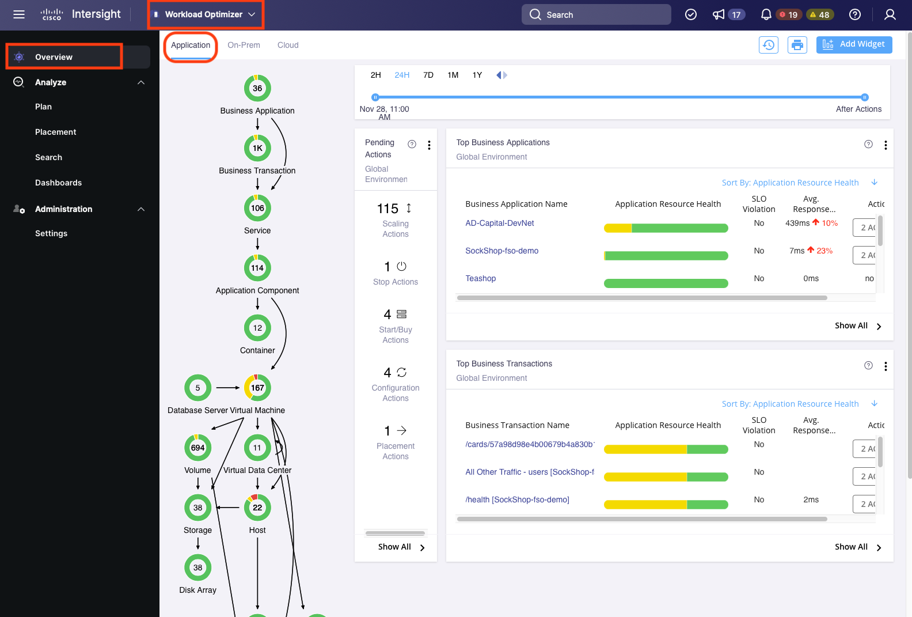

.. Tip::
        **Chart Time Frame** 
        
        You can set a time frame from recent hours to the past year, and set that to the charts in the view. Use the Time Slider to set specific start and end times within that range. The green section in the slider shows that you can set the time range to include a projection into the future. For this part of the time range, charts show the results you would see after you execute the current set of pending actions.
        
        For most charts, you can also configure the chart to hard-code the time range. In that case, the chart always shows the same time scale, no matter what scale and range you set for the given view.

        .. image:: images/intersight-iwo-time-slider.png
                :width: 90%
                :align: center

.. note:: 
    Intersight Workload Optimizer stores historical data in its database. The longer you run Intersight Workload Optimizer in your environment, the more history you can observe by setting the appropriate time range.

Change the view focus to the “SockShop-fso-demo” application information. You can do that by selecting the :guilabel:`SockShop-fso-demo` application from the :guilabel:`Top Business Applications` widget or by clicking the Business Application node of the supply chain, then selecting the :guilabel:`SockShop-fso-demo` application from the list of business applications:

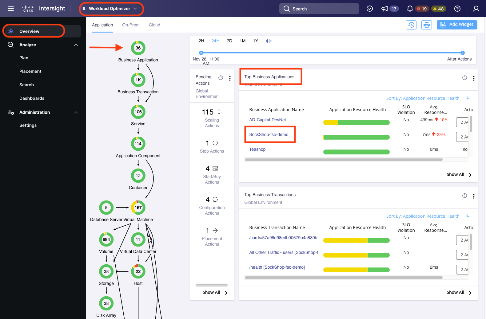

Switch your focus to the “SockShop-fso-demo” business application:

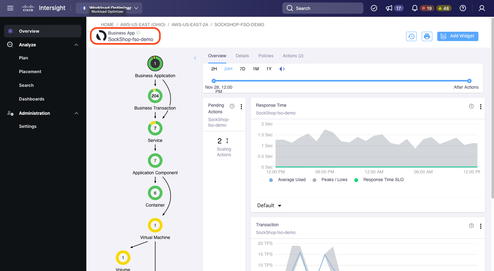

Take note of the following information for the "SockShop-fso-demo" application:

.. list-table::
   :align: center
   :widths: 25 65
   :header-rows: 1

   * - Business Application
     - SockShop-fso-demo
   * - Business Transaction
     - 
   * - Service
     - 
   * - Application Component
     - 
   * - Database Server
     - 
   * - Container
     - 
   * - Virtual Machine
     - 

Compare it with the information logged from the AppDynamics user interface and validate the entity mapping between AppDynamics and Intersight Workload Optimizer.

.. note:: 
    You may see more business transactions on the Workload Optimizer view than on AppDynamics. By default AppDynamics shows only the transactions with performance data. Try changing the “Filters” on the AppDynamics user interface.

The following table describes the entity mapping between AppDynamics and Intersight Workload Optimizer:

.. list-table::
   :align: center
   :widths: 30 30
   :header-rows: 1

   * - AppDynamics
     - Intersight Workload Optimizer
   * - Business Application
     - Business Application
   * - Business Transaction
     - Business Transaction
   * - Tier
     - Service
   * - Node
     - Application Component
   * - Database
     - Database Server
   * - Machine (when the machine type is Container)
     - Container
   * - Server
     - Virtual Machine

While on the Application Focused View, also notice the dashboard and widgets. Explore the different widgets available:

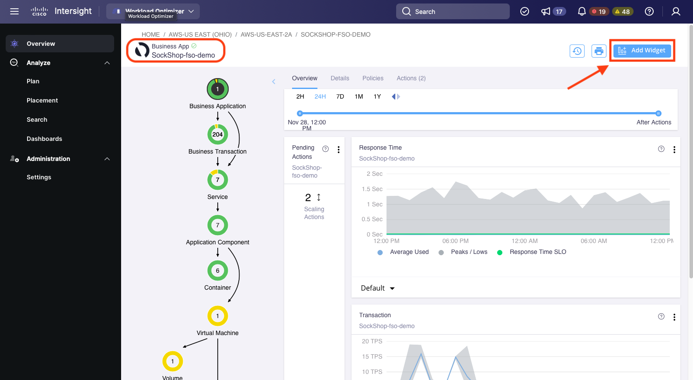

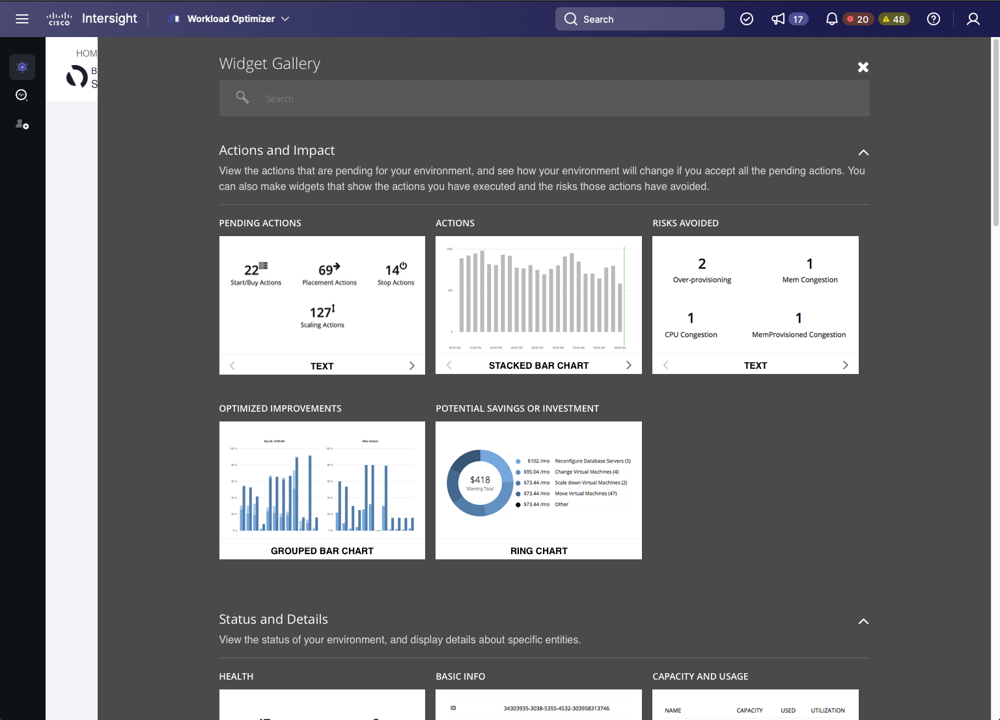

Identify the different types of actions available:

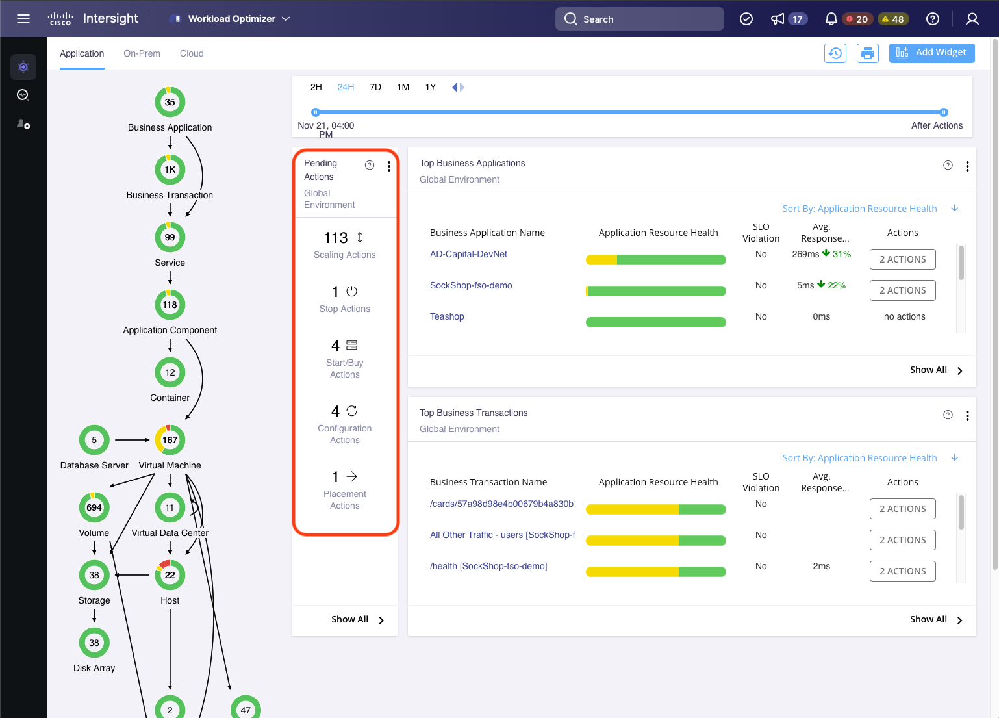

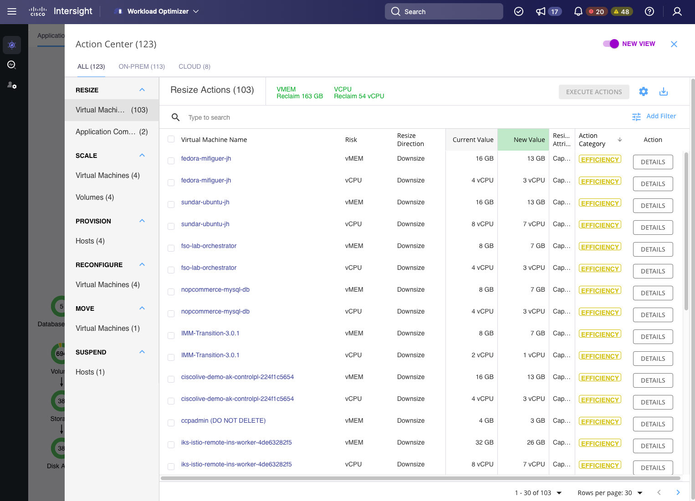

After you deploy your targets, Intersight Workload Optimizer starts to perform market analysis as part of its Application Resource Management process. This holistic analysis identifies problems in your environment and the actions you can take to resolve and avoid these problems. Intersight Workload Optimizer then generates a set of actions for that particular analysis and displays it in the Pending Actions charts for you to investigate.

3.2. Walkthrough IWO on-prem and cloud focused views
^^^^^^^^^^^^^^^^^^^^^^^^^^^^^^^^^^^^^^^^^^^^^^^^^^^^

AppDynamics allows you to quickly switch between on-premise and cloud environments. You can select the "On-Prem" view to look at on-prem specific supply-chain. 

Explore the :guilabel:`On-Prem` view including its dashboard and available widgets. You can add or edit the widgets as needed:

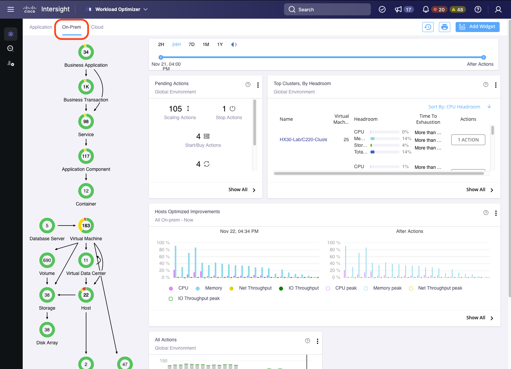

Similarly, when you set your session to the Global Scope, you can also select the "Cloud" view. This shows an overview of your cloud environment. 

Explore the :guilabel:`Cloud` view including its dashboard and available widgets. You can add or edit the widgets as needed:

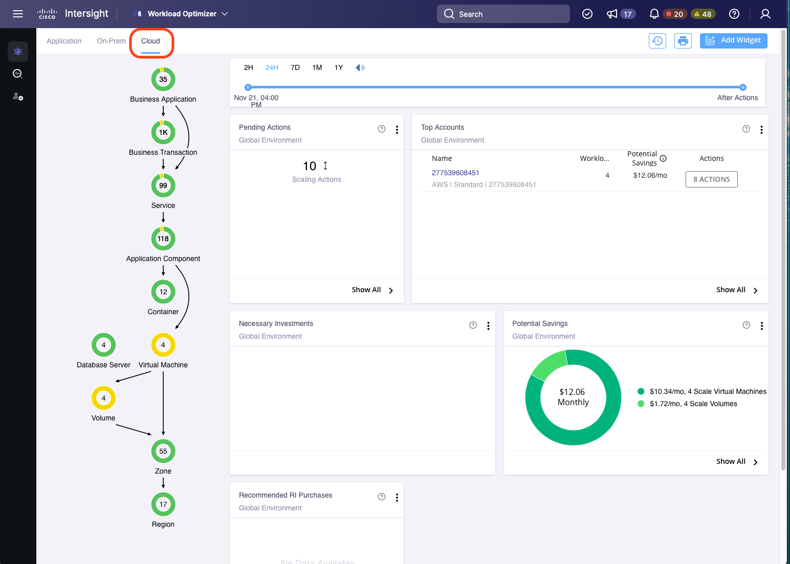

3.3. Create a custom dashboard
^^^^^^^^^^^^^^^^^^^^^^^^^^^^^^

Dashboards are used to give you views of your environment that focus on different aspects of the environment's health. At a glance, you can gain insights into service performance health, workload improvements over time, actions performed and risks avoided, and savings in cost. For cloud environments, you can see utilization of reserved instances, potential savings, required investments, and the cost/performance of specific cloud accounts.

The Dashboards page lists all the dashboards that are available to you, including the Executive Dashboards and any custom dashboards that your account can access. To view a dashboard, click its name in the list. From the Dashboard page, you can also create your own custom dashboards.

Navigate to the Dashboards page by clicking on :guilabel:`Workload Optimizer > Dashboards`:

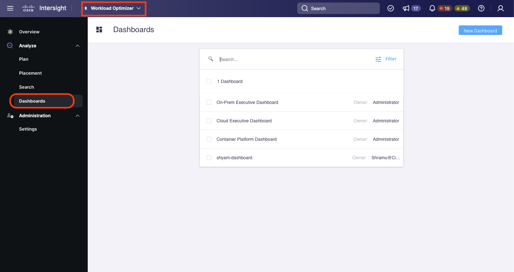

**Executive Dashboards**: The Executive Dashboard is a scorecard of your environment. It demonstrates how well you are improving performance, cost, and compliance by leveraging the Workload Automation that Intersight Workload Optimizer provides, as well as opportunities for further improvements that are available. Intersight Workload Optimizer ships with two Executive Dashboards:

- On-Prem Executive Dashboard

    .. image:: images/intersight-iwo-exec-on-prem.png
            :width: 90%
            :align: center

- Cloud Executive Dashboard

    .. image:: images/intersight-iwo-exec-cloud.png
            :width: 90%
            :align: center

**Custom Dashboards**: A custom dashboard is a view that you create to focus on specific aspects of your environment. You can create dashboards that are private to your user account, or dashboards that are visible to any user who logs into your Intersight Workload Optimizer deployment.

Two common approaches exist for creating custom dashboards:

- **Scope First**: You can create a dashboard in which all of the chart widgets focus on the same scope of your environment. For example, you might want to create a dashboard that focuses on costs for a single public cloud account. In that case, as you add chart widgets to the dashboard, you give them all the same scope.

- **Data First**: You might be interested in a single type of data for all groups of entities in your environment. For example, each chart widget in the dashboard can focus on **Cost Breakdown by Cloud Service**, but you set the scope of each chart widget to a different cloud region or zone.

You will now create a custom dashboard for the "SockShop-fso-demo" application. To start, click New Dashboard: 

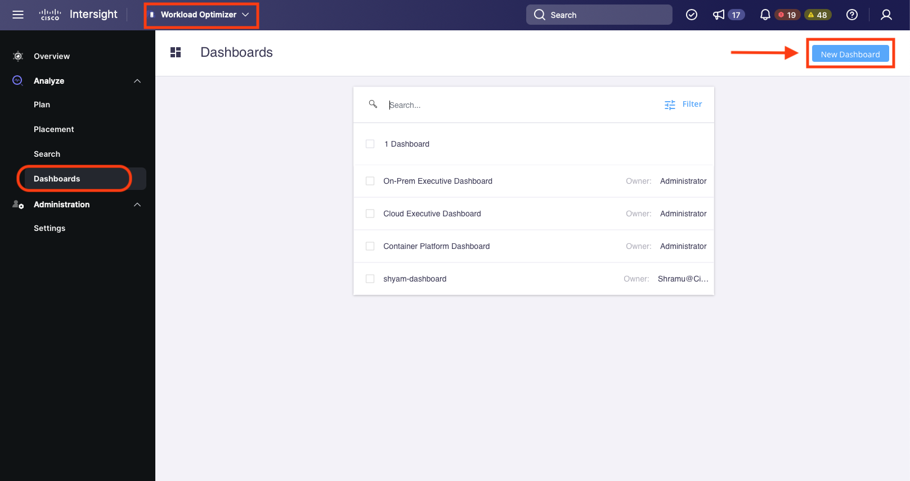

Give your dashboard a unique name that describes its purpose and click on the :guilabel:`Add Widget` button:

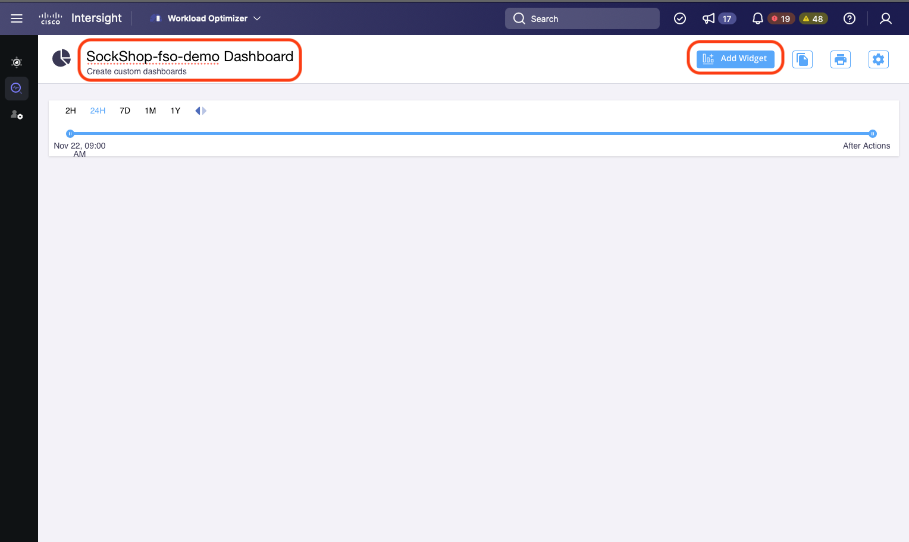

Scroll to the :guilabel:`Status and Details` panel then, hover your mouse over :guilabel:`Health` and then, click the right-arrow until the :guilabel:`RING CHART` type is selected. Click on the middle of the card:

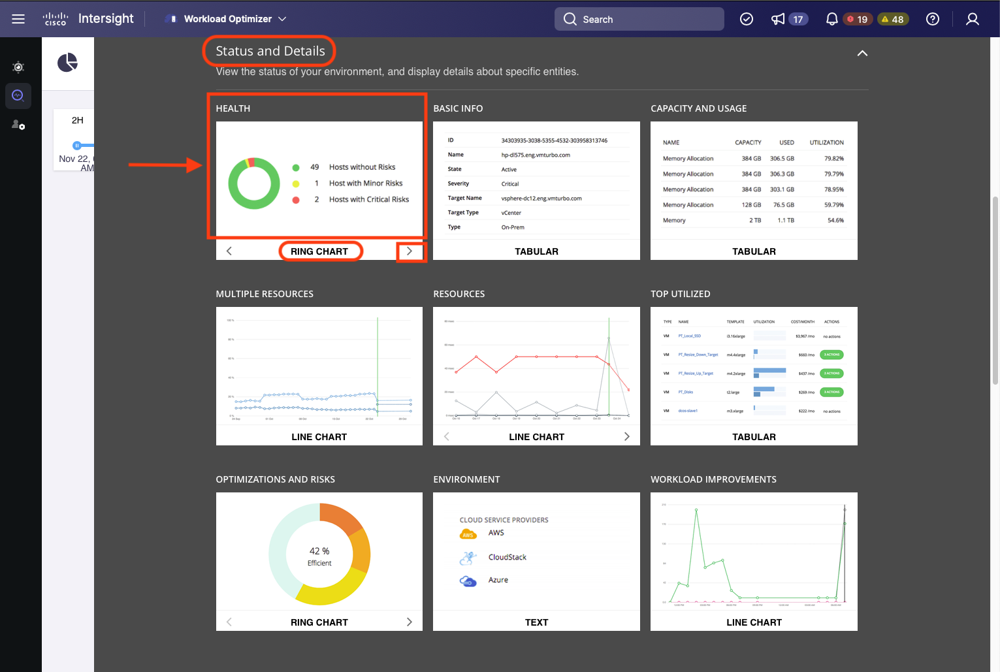

In the :guilabel:`SCOPE` click :guilabel:`(Click to change scope)`, expand :guilabel:`CLOUD`, select :guilabel:`Business Application`, and then select :guilabel:`SockShop-fso-demo`. In the Entity Type dropdown, select :guilabel:`Services` and then, click :guilabel:`Update Preview`. Click :guilabel:`Save`:

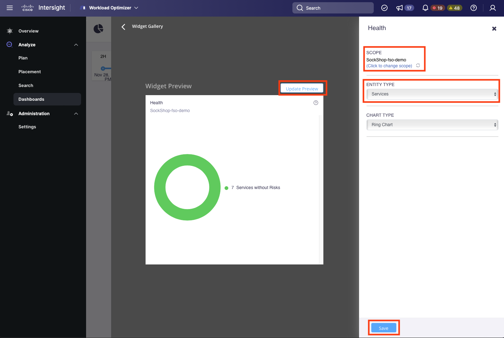

Add another widget to your dashboard. This time scroll to the :guilabel:`Actions and Impact` panel then, hover your mouse over :guilabel:`PENDING ACTIONS`. Click the right-arrow until the :guilabel:`TEXT` type is selected. Click on the middle of the card:

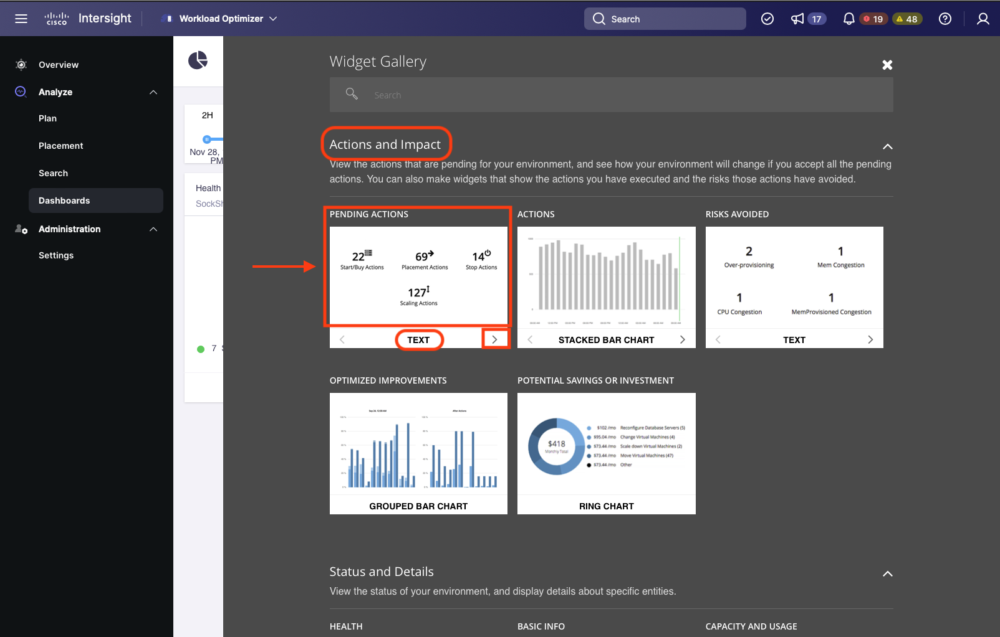

In the :guilabel:`SCOPE` click :guilabel:`(Click to change scope)`, expand :guilabel:`CLOUD`, select :guilabel:`Business Application`, and then select :guilabel:`SockShop-fso-demo`. Then click :guilabel:`Update Preview` and click :guilabel:`Save`:

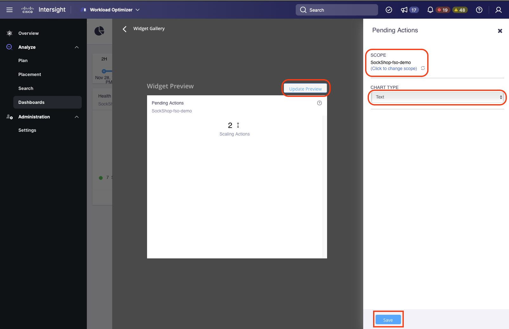

Add a third widget to your dashboard. Scroll to the :guilabel:`Status and Details` panel then, hover your mouse over :guilabel:`TOP UTILIZED`. Click on the middle of the card:

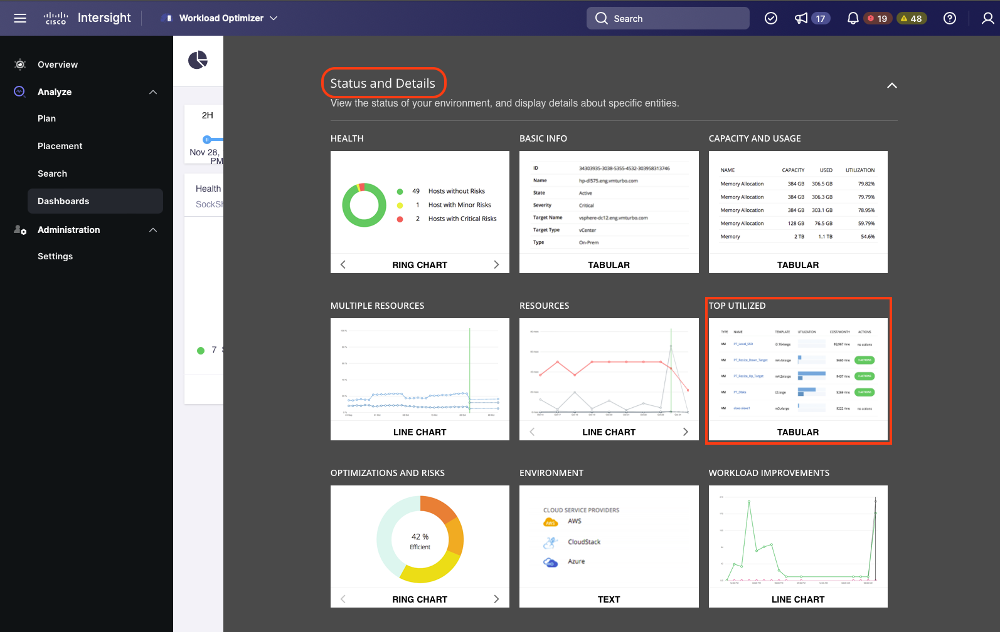

In the :guilabel:`SCOPE` click :guilabel:`(Click to change scope)`, expand :guilabel:`CLOUD`, select :guilabel:`Business Application`, and then select :guilabel:`SockShop-fso-demo`. In the Entity Type dropdown, select :guilabel:`Hosts` and then, click :guilabel:`Update Preview`. Click :guilabel:`Save`:

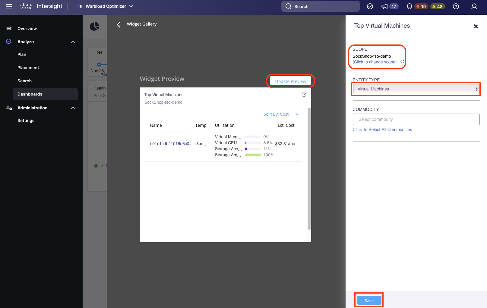

You can customize the size and placing of each widget on the dashboard. Your custom dashboard should now look similar to this one:

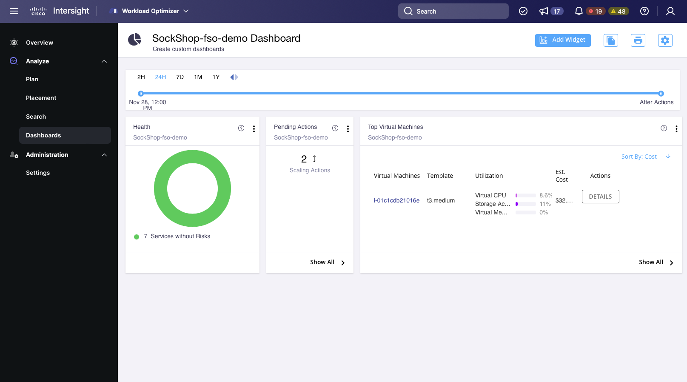

Make your dashboard available to all users. In the upper-right of the display, click the gear icon |gear-icon| and select the option for making the dashboard available to All Users:

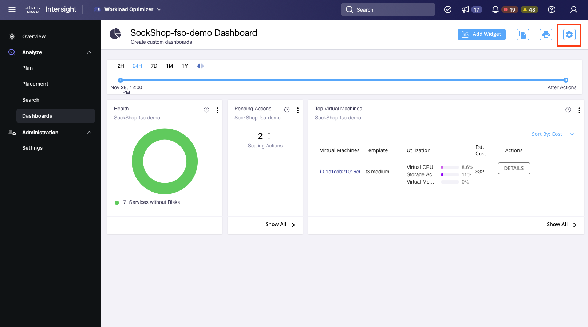

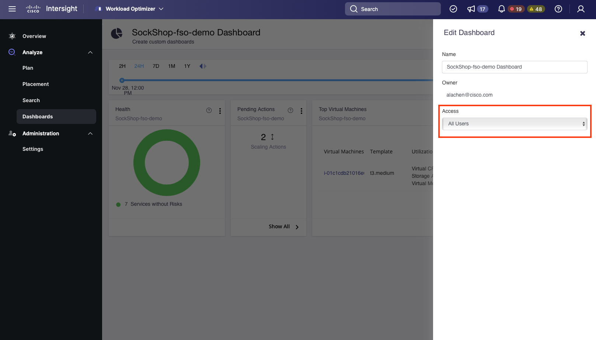

To complete this lab section, click :guilabel:`Dashboards` and select and delete your custom dashboard by clicking on the trash icon |trash-icon|:

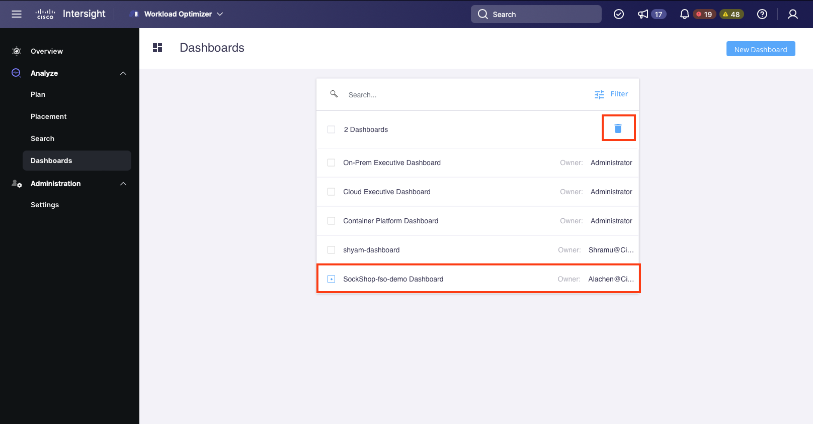

4. Explore supply chain components and associated actions
---------------------------------------------------------

In this section, we will focus on different supply chain components and recommended actions identified by Intersight Workload Optimizer (IWO). We will look at supply chain for SockShop application, but feel free to explore other applications as well. Each application may have different dependencies and will provide an opportunity to explore different supply chain components and actions. 

4.1. Explore business applications and the metrics, actions and policies associated to it
^^^^^^^^^^^^^^^^^^^^^^^^^^^^^^^^^^^^^^^^^^^^^^^^^^^^^^^^^^^^^^^^^^^^^^^^^^^^^^^^^^^^^^^^^
In Intersight, navigate to :guilabel:`Workload Optimizer -> Overview` and click on Business Application to see information regarding all business applications. Here, explore different Business applications that Intersight Workload Optimizer learnt from AppDynamics controller along with resources that are natively managed by Intersight. You can see statistics such as response time, transactions per second etc. averaged across all applications for different time periods.

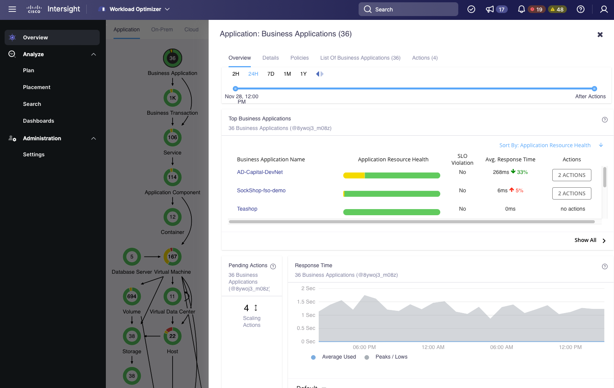

Click on :guilabel:`Details` to explore different type of metrics available across your applications.  

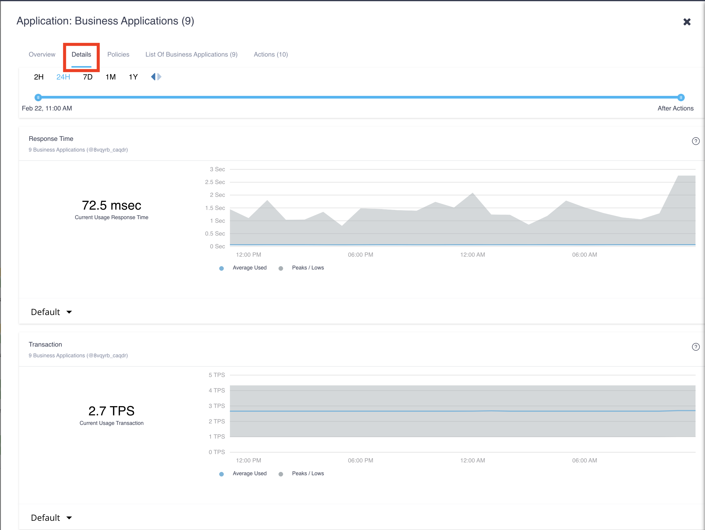

Click on :guilabel:`Policies` to see the policies implemented on a particular supply chain component

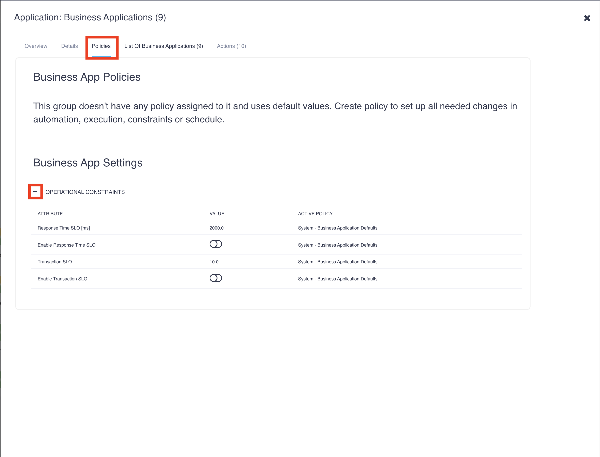

Click on :guilabel:`Actions` to see the IWO generated recommended Actions across all applications

.. note:: Intersight Workload Optimizer does not recommend actions for a Business Application, Business Transaction or Service. The actions associated with these components are recommended actions for the underlying Application Components and nodes that make up the application.

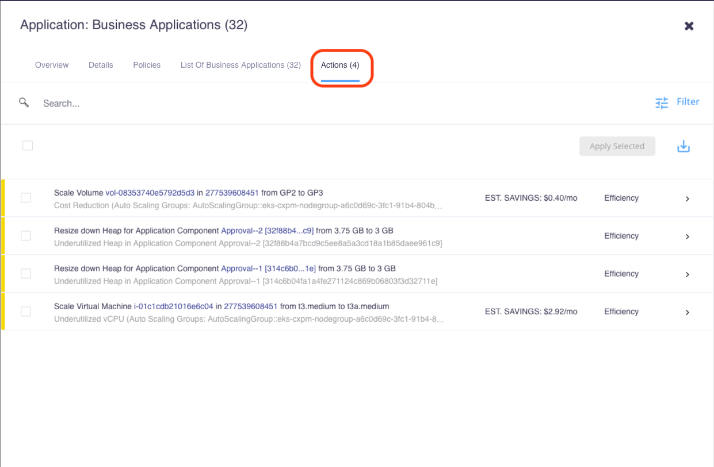

The goal of the first task is to get you familarized with the different menu items that you will see across all supply chain components. 

4.2. Focus on one application and its supply chain 
^^^^^^^^^^^^^^^^^^^^^^^^^^^^^^^^^^^^^^^^^^^^^^^^^^

Click on :guilabel:`List of Business Applications tab` to view all business application known to Intersight Workload Optimizer:

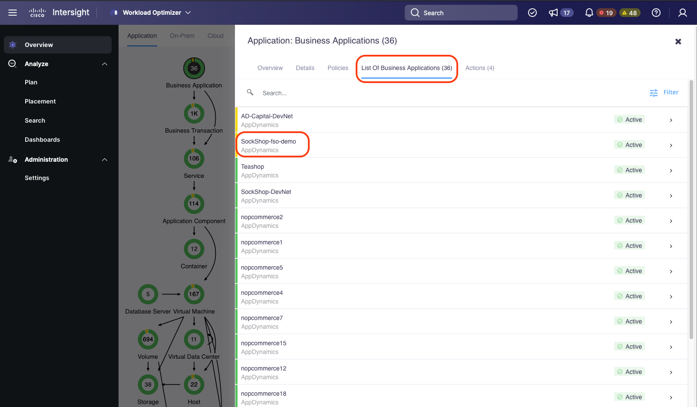

From the list of applications find and click on :guilabel:`SockShop-fso-demo` application to navigate to its very own supply chain. 

Notice how the supply chain shows all the components that make up the SockShop-fso-demo application. It includes all dependencies from business transactions to hypervisor and servers that provide the infrastructure for that application.  In the case of the SockShop application, IWO includes 204 business transactions, 7 Service, 7 Application Component, 6 containers and one virtual machines associated with it. 

.. image:: images/intersight-iwo-SockShop-4-2-2.png
        :width: 90%
        :align: center

4.3. Focus on one specific component in application supply-chain
^^^^^^^^^^^^^^^^^^^^^^^^^^^^^^^^^^^^^^^^^^^^^^^^^^^^^^^^^^^^^^^^

IWO offers a very versatile UI and allows users to drill-down on any component in the supply chain. 

Click on :guilabel:`Service` to see seven services serving the SockShop-fso-demo application. 

Pay attention to all tabs including :guilabel:`actions` and :guilabel:`policies`

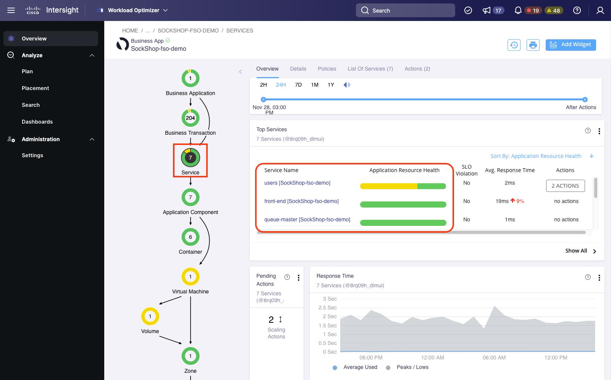

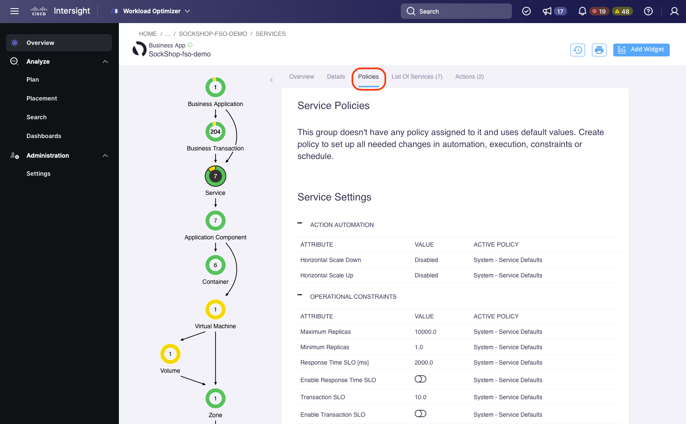

4.4. Explore Intersight Workload Optimizer actions 
^^^^^^^^^^^^^^^^^^^^^^^^^^^^^^^^^^^^^^^^^^^^^^^^^^
Intersight runs the applications resource management process based on the policies defined in Intersight and recommends actions to resolve any resource constraints or inefficiencies.

Intersight Workload Optimizer performs the following general types of actions:

      * Placement — Place a consumer on a specific provider (place a VM on a Host)
      * Scaling — Resize allocation of resources, based on profitability
      * Resize up - shown as a required investment
      * Resize down - shown as savings
      * RI Optimization — Purchase RIs for specific workloads or move to RI tiers that are more appropriate for your applications' requirements
      * Configuration — Correct a misconfiguration
      * Start/Buy — Start a new instance to add capacity to the environment, shown as a required investment. For workloads that are good RI candidates, purchase RI capacity to move your environment toward the RI Coverage that you desire.
      * Stop — Suspend an instance to increase efficient use of resources, shown as savings
      * Delete — Remove storage (for example, datastores on disk arrays or unattached volumes)

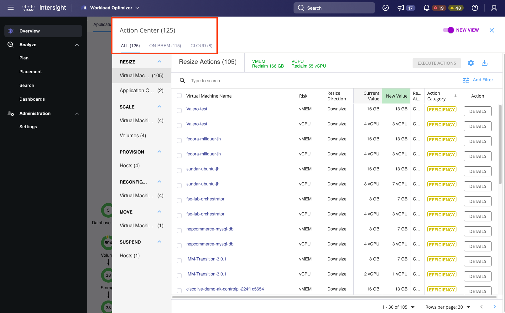

5. Learn about Intersight Workload Optimizer policies
-----------------------------------------------------
Policies set business rules to control how Intersight Workload Optimizer analyzes resource allocation, how it displays resource status, and how it recommends or executes actions. 

Intersight Workload Optimizer includes two fundamental types of policies: 

**Placement Policies:**
To modify workload placement decisions, Intersight Workload Optimizer divides its market into segments that constrain the valid placement of workloads. Intersight Workload Optimizer discovers placement rules that are defined by the targets in your environment, and you can create your own segments. 

**Automation Policies:** 
Intersight Workload Optimizer ships with default settings that are based upon industry analysis and should give the best results in most scenarios. These settings are specified in a set of default automation policies for each type of entity in your environment. For some scopes of your environment, you might want to change these settings. For example, you might want to change action automation or constraints for that scope. You can create policies that override the defaults for the scopes you specify.

In this section of the lab, we will look at examples of existing placement and automation policies and create a new policy. 

5.1. Learn about imported placement policies
^^^^^^^^^^^^^^^^^^^^^^^^^^^^^^^^^^^^^^^^^^^^

In Intersight navigate to :guilabel:`Workload Optimizer` ->  :guilabel:`Administration` -> :guilabel:`Setting` -> :guilabel:`Policies` to look at all Intersight Workload Optimizer(IWO) policies

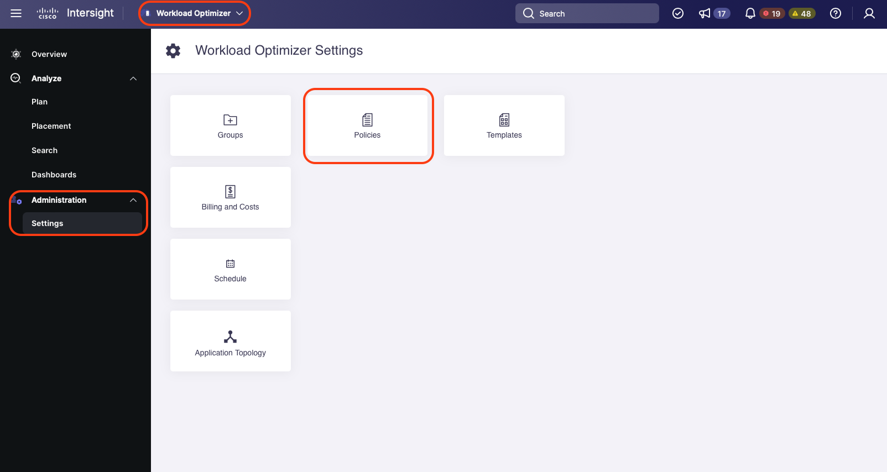

By default, IWO can automatically import placement policies defined in vSphere vCenter DRS rules and Microsoft’s System Center Virtual Machine Manager (SCVMM) availability sets.

Click on Imported Placement Policies and you should see DRS placement policies that were automatically imported from VMware vCenter

.. image:: images/intersight-iwo-Policies-Imported-5-1-2.png
        :width: 90%
        :align: center 

Intersight Workload Optimizer supports the following placement policies: 

* Place — Determine which entities use specific providers. For example, the VMs in a consumer group can only run on a host that is in the provider group. You can limit the number of consumers that can run on a single provider — for hosts in the provider group, only 2 instances of VMs in the consumer group can run on the same host. Or no more than the specified number of VMs can use the same storage device. 
* Don't Place — Consumers must never run on specific providers. For example, the VMs in a consumer group can never run on a host that is in the provider group. You can use such a segment to reserve specialized hardware for certain workloads. 
* Merge — Merge clusters into a single provider group. For example, you can merge three host clusters in a single provider group. This enables Intersight Workload Optimizer to move workload from a host in one of the clusters to a host in any of the merged clusters to increase efficiency in your environment. 
* License — Set up hosts to provide licenses for VMs. For VMs that require paid licenses, you can create placement policies that set up certain hosts to be the VMs' preferred license providers. Intersight Workload Optimizer can then recommend consolidating VMs or reconfiguring hosts in response to changing demand for licenses.

5.2. Take a look at default automation policy
^^^^^^^^^^^^^^^^^^^^^^^^^^^^^^^^^^^^^^^^^^^^^

We can now explore IWO automation policies. Intersight Workload Optimizer comes with a set of default policies that are based on industry best practices. However, these policies can be further automated and fine-tuned based on application requirements.

Navigate to :guilabel:`Workload Optimizer` ->  :guilabel:`Administration` -> :guilabel:`Setting` -> :guilabel:`Policies` -> :guilabel:`Defaults` -> Search for :guilabel:`Virtual Machine`

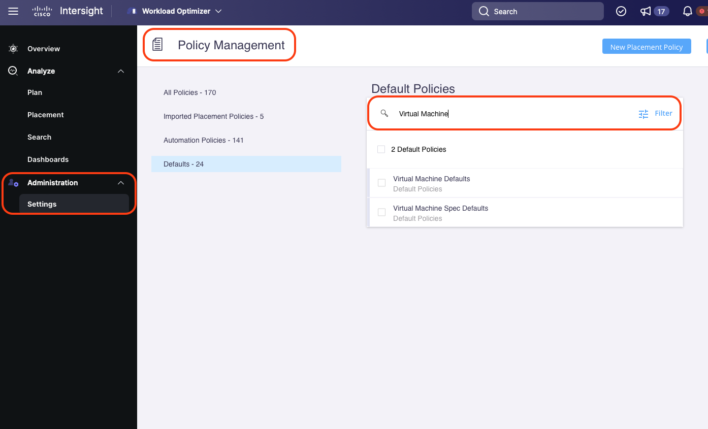

Click on :guilabel:`Virtual Machine Default`, expand and explore the setting in each of the four sections: Automation and Orchestration, Action constraints, Operations constraints, and Scaling constraints

.. warning::
        Since this lab is on shared Infrastructure, please do not make any changes to the default setting. 

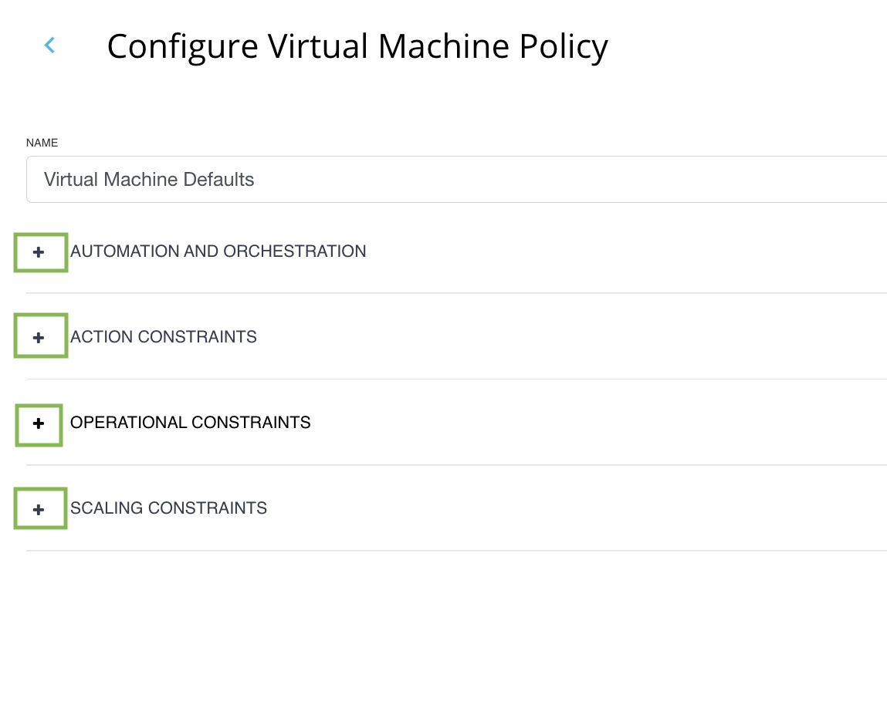

6. Intersight Workload Optimizer plan management walkthrough
------------------------------------------------------------

Intersight Workload Optimizer uses real-time data from your workloads and allows the capability to create plans that can help you simulate scenarios such as: 

* Reducing cost while assuring performance for your workloads 
* Impact of scaling resources 
* Changing hardware supply 
* Projected infrastructure requirements 
* Optimal workload distribution to meet historical peak demands 
* Optimal workload distribution across existing resources

6.1. Create Optimize Cloud plan
^^^^^^^^^^^^^^^^^^^^^^^^^^^^^^^

In this section of the lab, we will create a plan to optimize cloud resource. 

Navigate to :guilabel:`Workload Optimizer` -> :guilabel:`Analyze: Plan` in Intersight and click on :guilabel:`New Plan`

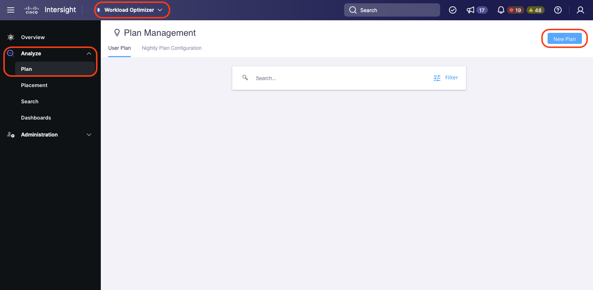

Select :guilabel:`Optimize Cloud`

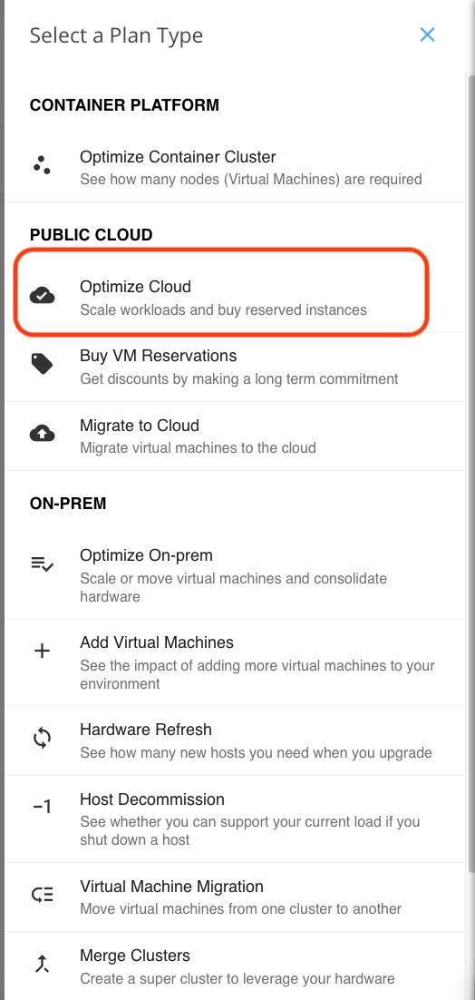

Select :guilabel:`Cloud Provider` and select the cloud provider to optimize

.. image:: images/intersight-iwo-plan-Cloud-Select-6-3.png
        :width: 70%
        :align: center 

Select AWS account that’s integrated with Intersight and click :guilabel:`Next: Optimization Settings`

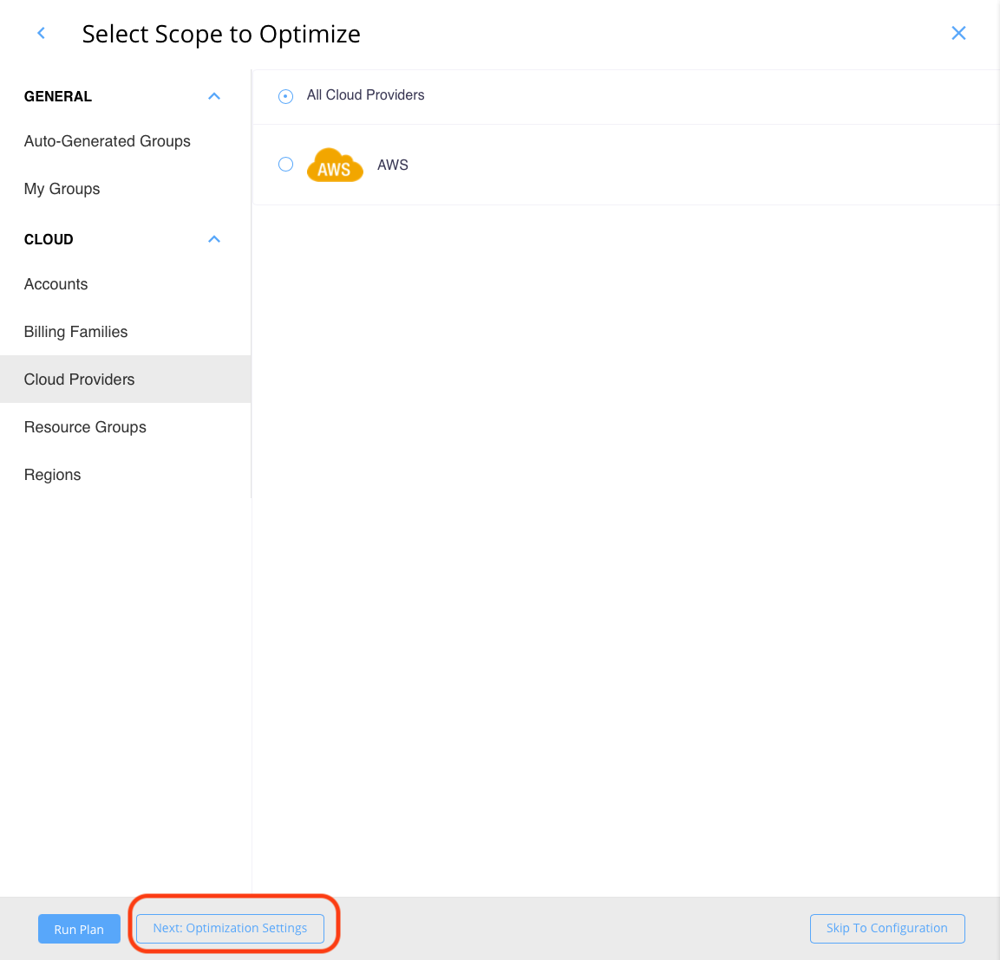

Select  the optimization setting from the list and click :guilabel:`Next: RI settings`

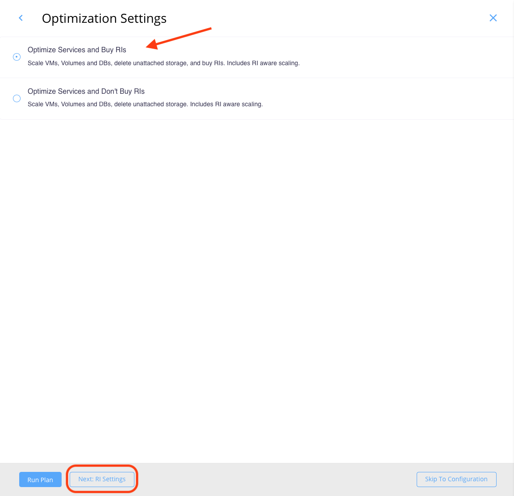

Review the AWS reserved Instance settings and click :guilabel:`Run Plan`


Review the optimization options generated 


6.2. Create Optimize On-Prem plan
^^^^^^^^^^^^^^^^^^^^^^^^^^^^^^^^^

In this last section of the lab, we will create a plan to On-Premises resources. 

Navigate to :guilabel:`Workload Optimizer` -> :guilabel:`Analyze: Plan` in Intersight and click on :guilabel:`New Plan`

Select :guilabel:`Optimize On-prem`


Select :guilabel:`Plan Scope` and select the Cluster to optimize nd click :guilabel:`Next: Virtual Machine Actions`


Select VM Scale action and click :guilabel:`Next: Host Actions`


Select the optimization host actions from the list and click :guilabel:`Next: Storage Actions`


Select the optimization storage actions from the list and click :guilabel:`Next: Constraints Settings`


Select the Ignore Contraints Setting and click :guilabel:`Next: Desired State`


Review the desired state settings and click :guilabel:`Run Plan`


Review the optimization options generated


This concludes the FSO Hybrid Cost Optimization Lab

.. sectionauthor:: Alan Chen <alachen@cisco.com>
