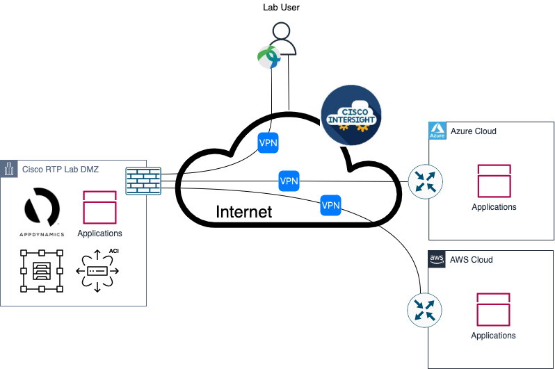

Solution Deployment
###################

For this lab, the solution has already been deployed. You will be using applications running on-prem and on-cloud which have already been onboarded on an AppDynamics SaaS controller. The steps to onboard the application on AppDynamics were covered in the :doc:`Hybrid Application Monitoring </HAM/index>` lab. You will explore an application on AppDynamics, walkthrough the steps to integrate the AppDynamics controller to Intersight, explore an application on Intersight Workload Optimizer and walkthrough the steps needed to configure Intersight Workload Optimizer features (plans, policies, billing, cost, reports).

Prerequisites
-------------

The following prerequisites are necessary to run this lab:

- Access to AppDynamics SaaS controller (https://cisco-cx-ps-lab.saas.appdynamics.com)
- Access to Intersight/IWO (https://www.intersight.com)
- SockShop-fso-demo application already onboarded on AppDynamics

Lab Access
----------

In this lab, you will be accessing Cisco AppDynamics SaaS controller and Cisco Intersight Software as a Service Solution. 

.. note::
    This lab is a shared resource. We have done our best to sandbox the environment that you will be accessing. However, we kindly ask you to avoid creating, modifying or deleting objects out of the lab guide scope. Thank you!

Resources access information:

.. csv-table::
    :align: center
    :file: ./lab-resources.csv
    :widths: 40, 40
    :header-rows: 1

.. note::
    Access credentials will be provided during the lab session if it is a live lab or in a separate method (Email, File, WebEx, etc.) if it is an on-demand lab.

Lab Topology
------------

The following topology is used in this lab:

Summary of Lab Activities
-------------------------

During this lab, the following activities will be performed:

#. Walkthrough AppDynamics “SockShop-fso-demo” onboarded application.
#. Walkthrough AppDynamics and Intersight integration.
#. Walkthrough Intersight Workload Optimizer “SockShop-fso-demo” supply chain.
#. Explore supply chain components and associated actions.
#. Learn about Intersight Workload Optimizer Policies.
#. Intersight Workload Optimizer Plan management walkthrough

.. sectionauthor:: Alan Chen <alachen@cisco.com>
