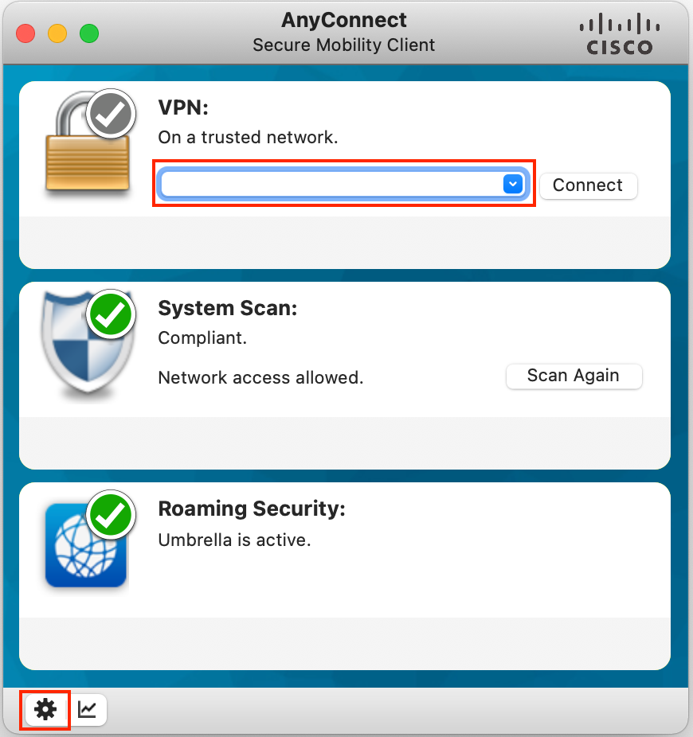
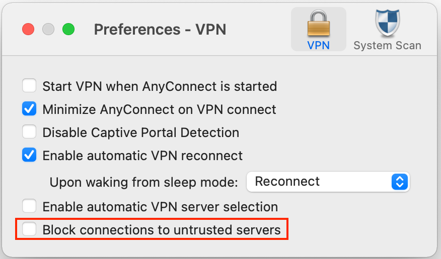
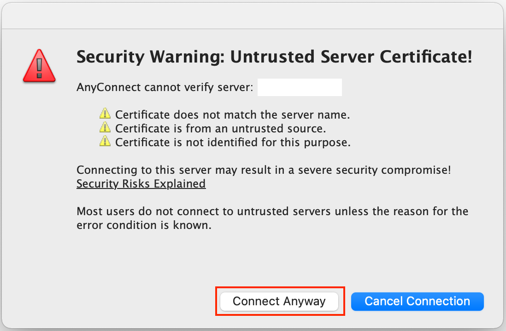
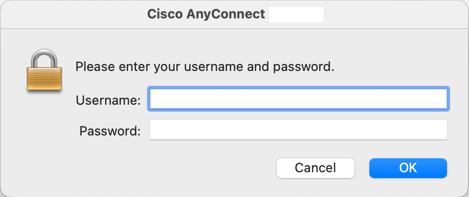

############
Introduction
############

This Lab Guide is intended to be used by attendees of Full-Stack Observability (FSO) enablement sessions. The labs in this guide consist of hands-on exercises related to the activities the delivery engineers will have to perform when delivering the following Cisco FSO use cases:

- `Hybrid Application Monitoring (HAM) <https://ebooks.cisco.com/story/sales-play-appendix/page/2/2>`_
- `Hybrid Cost Optimization (HCO) <https://ebooks.cisco.com/story/sales-play-appendix/page/2/8>`_
- `Customer Digital Experience Monitoring (CDEM) <https://ebooks.cisco.com/story/sales-play-appendix/page/2/15>`_

Throughout the lab activities, we will use a fictitious company called ACME, and an open-source eCommerce application based on the Microsoft .NET framework called `nopCommerce <https://www.nopcommerce.com/>`_.

**ACME Background**

ACME is an online retailer company that has migrated some services of its eCommerce platform, based on `nopCommerce <https://www.nopcommerce.com/>`_, to a public cloud provider. After the migration, some customers are complaining about slowness and errors while buying their loved products in the online store.
ACME decided to invest in Cisco's FSO solution to: 

- Measure the online store application's performance from the end-user perspective 
- Alert the right Ops team when the end-user experience or business is impacted 
- Quickly detect and isolate problems, and trace bad user experiences to issues with their backends, network, cloud provider, and external services not under their control. 

**Demo Application**

`nopCommerce <https://www.nopcommerce.com/>`_ is an open-source eCommerce platform that we will use in this FSO training. It is based on ASP.NET framework, written in C# and it has two tiers: Web and DB.

.. figure:: images/nopcommerce-architecture.svg
    :align: center

ACME has migrated nopCommerce Web tier to Microsoft Azure and has decided to keep the MySQL database server used by nopCommerce on-premise.

Lab Prerequisites
##################

- Take recommended AppDynamics and ThousandEyes trainings
- Microsoft Remote Desktop application
- Cisco AnyConnect Secure Mobility Client

Lab Topology
############

The Lab environment contains the following components:

- **nopCommerce application**:
 
    - **Web tier**: runs as an Internet Information Service (IIS) web application on a Windows Server 2019 Datacenter VM hosted on Microsoft Azure
    - **Database tier**: a relational MySQL DB running on CentOS Linux VM hosted on ACME private cloud

- **Full-Stack Observability SaaS Controllers**:

    - `AppDynamics <https://cisco-cx-ps-lab.saas.appdynamics.com/controller/>`_
    - `ThousandEyes <https://app.thousandeyes.com/>`_
    - `Intersight <https://intersight.com/>`_

- **Public cloud**: 

    - Microsoft Azure

- **ThousandEyes Enterprise Agents**:

    - **On-Prem**: Virtual appliance containing a pre-built ThousandEyes Enterprise Agent
    - **Azure**: An Ubuntu VM where you will install the ThousandEyes Linux package

You will access the Lab environment from your laptop via VPN.

.. image:: images/lab_topology.svg
    :align: center

Lab Access
##########

Some labs will require you to use the **Cisco AnyConnect Secure Mobility Client** to connect to the Lab environment through a VPN. The instructor will provide the VPN server and credentials information at the beginning of the lab when required.

1. Open **Cisco AnyConnect Secure Mobility Client**

2. Enter the IP address of the VPN server (provided by the instructor) and click the small gear icon located at the bottom left corner of the window:

3. Un-check the **Block connections to untrusted servers** option:

4. Close the **Preferences** window and click **Connect**.

5. If the following security warning appears, click **Connect Anyway**:

6. Enter your VPN credentials, and click **OK**:

At this point, you should be connected to the Lab VPN.

.. sectionauthor:: Jairo Leon <jaileon@cisco.com>, Ovesnel Mas Lara <omaslara@cisco.com>